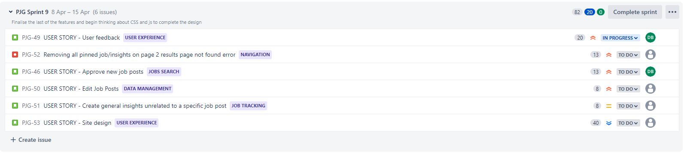

# Agile Methodology
## Overview
Due to some slight familiarity with [JIRA](https://dnlbowers.atlassian.net/jira/software/projects/PJG/boards/4/roadmap) from my current job, I decided to use JIRA over the project board on Github. I wanted to access the different tools and analytics built-in as default. 

I split all user stories into several epics and linked each story/bug fix ticket to the related epic. I then toggled the priority to represent must-haves, should-haves, nice to have, etc. Each ticket priority would vary from sprint to sprint in line with an agile methodology.

While I found it challenging to be a one-person agile team, I certainly saw the benefit of keeping me focused on the task. I regularly stopped between sprints to reevaluate the MVP, prioritizing each task in terms of the returned value to the user while keeping a releasable product with the available time in mind.

## Sprint Notes
Below is a summary of learnings from each iteration.

### Sprint 1 notes:
My first sprint was short; I intended to get more familiar with JIRA and get the initial app set up and deployed. 
* I set a time limit from 23:40 on 04/02 until 02:00 05/02.
* There were five tasks, each with one story point. 
* During the last sprint stage, I  had some issues with getting the app to display via Heroku and realized I had underestimated the story points on this task.
*I finished the sprint ahead of time at 01:40 05/02

### Sprint 2 notes:
* Decided to set sprints to one week at a time
* Decided the API would slow me down too much, so I lowered the priority for this sprint.
* Decided to build out the site structure with the backup plan of user posting jobs for others to view
* Due to the change in tactic, I added user stories as I progressed, which would be bad practice when working as part of a team. I will take extra care to plan tasks out ahead of the sprint initialization in my next sprint.
* This sprint felt chaotic and disorganized partly because I was still learning how to structure a project using the agile methodology while at the same time learning a new framework. After reading [this article on writing good user stories](https://www.industriallogic.com/blog/as-a-developer-is-not-a-user-story/) I changed all user stories with the developer as the user to "developer task,"  and I believe this with better pre-planning of a sprint will assist me moving forward to be more organized.
* Too many must-haves due to poor planning.
* After concluding the sprint, I believe that many of the issues I was having using agile development were due to my planning not being thorough enough and a lack of understanding of some of the key concepts required to work with data models within Django. I have resolved to go back into the research and planning stage to gain further clarity before the third sprint. I will draft the features in my readme to clarify further and drill down on the MVP. I hope it will help me follow the above-referenced article to write better user stories for my sprints so that all sprint tasks are solely to provide relevant value to the user. 

### Sprint 3 notes:
* Due to the time to plan between sprints 2 and 3, this sprint felt a lot smoother. 
* My burn-down chart reflects a downwards trend; however, I over-committed with the number of user stories added at the sprint setup phase. The issue here is not knowing exactly when I will have time to work on the project, and so I have no way of accurately predicting how many stories I will be able to complete.
* To combat this, I will refine my priorities each sprint and ensure I only work on the highest priority ones each time, as I did with sprint 3. 

### Sprint 4 notes:
* Since in sprint 3, I managed to complete six user stories, I chose to take all the remaining seven into sprint 4.
* Due to several commitments outside of the course, I only completed one task. I have not had much time to work on the project due to having a tech interview questionnaire to complete.
* Due to the above, this turned into a dummy sprint with little achievement. Until I had to divert my attention, the burn-down chart was looking ok, so I will re-add the stories to the next sprint with reassessed priorities.

### Sprint 5 notes:
* I re-added all the user stories to this sprint but underestimated the time required to implement the pin job feature. As a result, I only managed to get two stories done in this sprint.
* I allowed myself to run over the allotted time for this sprint while I completed the Pin job feature, although I concluded the task with a bug and created a bug ticket to enter the next sprint

### Sprint 6 notes:
* I realized that I concluded PJG-29 prematurely. I had to reopen this story to create the view and a rendered page for the user-specific pinned jobs to be displayed
* I concluded this sprint with just three tasks left to create the core functionality of my MVP. 
* I realized that the periods between sprints are useful for reflection on current progress and have realized some other stories that I need to add to the backlog.
    * Add job post.
    * Display insights chronologically.
    * Note/insight deletion.
    * Bug tickets added for issues found with user stories implemented during the previous sprints
* I am still trying to get the hang of story points and my velocity rate. I feel this will improve as I become more familiar with the framework. 
* I am beginning to rethink a profile page as it seems unnecessary for the initial release of my MVP.

### Sprint 7 notes:
* First time my burn-down chart met with the expected trajectory largely due to a limited number of user stories.
* Realized my mistake of meeting the criteria of 60% must-haves in a sprint. I planned for 60% of the overall tasks and not 60% of the story points. I will fix this from the next sprint onwards.
* Decided to keep the job list page as the home page (initially, this was only a temporary measure). However, in the course of development, I decided that a hero image would look good below the navbar and decided to implement this instead of the carousel I had planned initially.
* Since the idea of a user profile seemed to be less relevant at this stage, I used the last day of sprint seven to plan other user stories to plan the next stages of development to provide the most value to the user.

### Sprint 8 notes: 
* I have added several user stories aiming all tasks at adding value to the user
* I have assigned 60% of the story points as "must-haves" instead of 60% of the tasks.
* Burn down chart was looking good until PJG-49 where I got stuck understanding how to utilize messages in Django. I started to make progress when the sprint concluded mid-task. PJG-49 will now be the first task of the next sprint, so I can complete the JS required to close the alerts and implement a modal.

### Sprint 9 notes: 
* 60% of the story points were most of my stories because one user story covered a  final over hall of the front-end design worth 40 story points (PJG-53). While I could have broken this down into separate tasks, I was trying to stay with the logic of using user stories that added value, and I was finding it difficult to catalog each task in the reaming time
* This sprint aims to conclude with all functionality intact (or conclude very near to it).
* I will note design thoughts and ideas as I go to implement them later during PJG-53.
* The sprint finished partway through PJG-53;  I will pass this story into the next sprint.

### Sprint 10 notes: 
* There are slightly more than 60% of story points as must-haves because I need to ensure I solve the bugs which cannot be considered features.
* This sprint aims to have the site ready in production, ready for release. I want to add more to this project; however, there are deadlines in the real world, and this project is running out of time before submission. I treat this as the first release and will continue to improve after the course.
* Finished this sprint two days early. Although I finished this early, it was a more challenging sprint due to PJG-53 of 40 points; in the future, I would break this story down into sub-tasks to help stay more focused while styling the front end. 

### Sprint 11 notes: 
* This sprint was all must haves to prepare for submission

