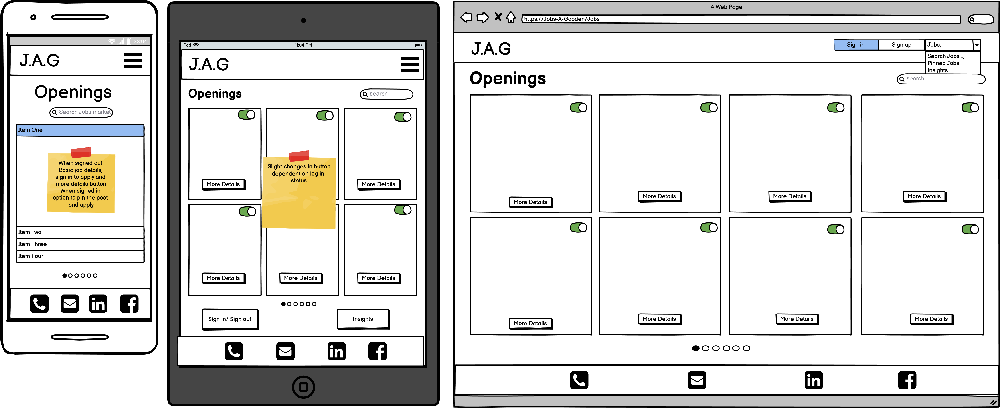

# Jobs-A-Gooden
As a developing developer, job hunting is something I have found at the forefront of 
everyone's mind. The app aims to be a proof of concept using a single API to fetch 
current job roles and provide a method for the user to pin jobs and make notes to 
track the status of their application processes and any insights gained along the way.

https://jobs-a-gooden.herokuapp.com/

##Strategy 
On average, it takes a new developer around 20-25 interviews to land their first 
developer job, and this does not include the total amount of applications sent out 
but a job seeker.

It can be hard to keep track of job specs when a company responds, especially 
when using multiple sites to check for roles, or worse yet, several months 
have passed since you sent the application.

This app aims to streamline the process by using an  API to search for job posts 
from various companies and once applied for, the job spec would be neatly stored 
to refer back to later. 

Doing this will allow the user to know what is expected during the selection process 
and make it easier for the candidate to research the potential employer upon 
response to their application. The personal board would also allow the user to make 
notes to review their insights of the process and any company feedback.

###Opportunities:
**Feasibility chart here to lead into scope (the MVP)**

##Scope
* Use the above to describe the scope of the MVP the remaining go to future developments

##Structure
###Flow Charts:

* What state changes need alerts? log in, log out, 404, 500, pop up for apply. 
Make a section in the features with screenshots vut reference this here.

##Skeleton
###wireframes:

##Surface
###Color scheme:

###Typography:

##Data Model

## Credits
* Flow chart symbol meaning taken from [conceptdraw.com](https://www.conceptdraw.com/How-To-Guide/flow-chart-symbols)
* Guidence on file structure for templates folder from [learndjango.com article](https://learndjango.com/tutorials/template-structure)
* [Jaguar Vectors by Vecteezy](https://www.vecteezy.com/free-vector/jaguar)