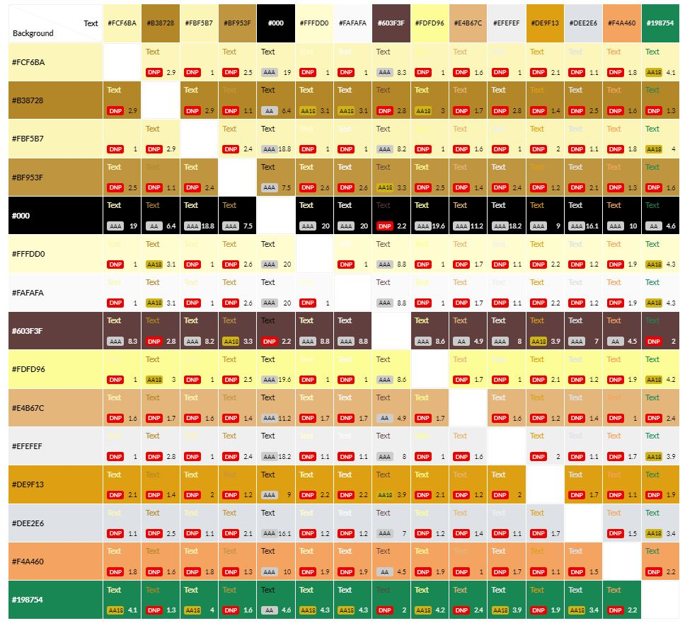

# Jobs-A-Gooden
As a developing developer within a group of peers, job hunting is something I have found at the forefront of everyone's mind. 

This site is a community job share platform. It provides a method for users to save job posts, make notes to track their applications, and journal insights as they progress.

# **AM I RESPONSIVE SCREENSHOT HERE**

[Deployed site](https://jobs-a-gooden.herokuapp.com/)

# Planning Phase
## Strategy 
### Site Aims:
It takes a new developer around 20-25 interviews to land their first developer job. This does not include the total number of applications sent out by a job seeker.

Keeping track of one's applications can be troublesome. When a company responds, it can be hard to remember the job post requirements, especially when multiple sites are used to check for roles. Worse yet, several months have passed since you sent the application.

This app aims to streamline the process by allowing users to submit a Job advert of interest to them. Once approved by the admin, the job spec would be neatly stored to refer to later, along with any notes or insights the user wishes to keep. 

Doing this will allow the user to track what is expected during the selection process and make it easier for the candidate to research the potential employer/role upon response to their application. The advert is safely stored on the site. The personal board would also allow the user to make notes to track their application to review their insights of the process and any company feedback provided after an interview.

### Opportunities:
The was an extended range of features during my brainstorming session for this site. I had to use a feasibility chart to narrow it down and prioritize the scope of the intended strategy. 

Opportunity | Importance | Viability/Feasibility
---|---|---
Job search | 5 | 5
User can pin jobs | 5 | 5
User specific job notes | 5 | 5
Landing page with site overview | 5 | 5
Progress tracker (Kanban board) | 3 | 1
Direct application to jobs | 2 | 1 
Manually add jobs (admin/employer) | 5 | 5
Jobs blog | 1 | 3
Tips/resources | 2 | 4
Personal insights | 5 | 5 
Employer ratings | 1 | 5 
Number of users applied | 1 | 1 
User log in | 5 | 5
Direct email to employer with CV/cover letter attachments | 2 | 1 
Community mentorship | 1 | 1
Freelance specific jobs board | 1 | 1
API to fetch jobs data | 5 | 2 
User profile | 5 | 5
----------------------------------------|----|----
Totals | 59 | 60 

Viability and feasibility in the above table are based on both time and current level of ability using different languages/frameworks. 

## Scope

Due to the imbalance in scores above there will definitely be some tradeoffs, however, I anticipate that there will need to be some trade offs due to the time set for this project. 

I have further divided this table into 3 categories to help prioritize the order of importance and clarify the MVP required to launch as a basic proof of concept whilst meeting the above objective. These three categories are:-
* UX efforts **must** address these:
    * User can pin Jobs.
    * Manually add jobs (approved only by admin).
    * User specific job notes.
    * Personal insights.
    * User login.

  
* UX efforts **should** accommodate these:
    * API to fetch jobs data
    * Tips/resources.
    * Progress tracker (Kanban board).
    * User profiles
    * Landing page with site overview.
    * Job search.
  
* **Unwise** use of time to address there:
    * Direct application to jobs.
    * Jobs blog.
    * Employer ratings.
    * Number of users applied.
    * Direct email to employer with CV/cover letter attachments.
    * Community mentorship.
    * Freelance specific jobs board.

## Structure   
To help me visualize a typical user journey around the site, I used [draw.io](https://app.diagrams.net/) to help me plan out the various routes a user could take through the site. This flow changed slightly throughout development, specifically with the dropping of an API for the jobs data. However, in general, it guided the process.

### Flow Charts:

### User Stories:  

* As an **Admin** I can...
    * **use a text editor within the admin panel** so that **I can create a job description in a way that is clear and appeals to the eye when creating a job post**    
    * ...**Log into a user interface** so that **I can easily manage data via a user interface**
    * ...**easily navigate the admin panel** so that **I can view, search, add and delete jobs**
    * ...**Approve new job posts offered by the community for the community** so that **I can ensure that posts are not malicious, false, misleading, or incomplete.**
    * **Delete a Job post** so that **I can remove jobs that are no longer relevant or available.**
    * **Edit a job post with out the need of using the admin panel** to that **if I spot a mistake or update a job post I can do so quickly and easily with out issue.**
 
* As an **Unregistered User** I can... 
    * ...**quickly determine the subject of the site** so that **from the landing page I can see if I want to continue spending my time on this site and register**
    * ...**register for an account** so that **I can enjoy a personalized experience as a job seeker or employer**
    * ...**browse the available jobs (brief description only)** so that **I can see if I wish to register with the site or not**
  
* As a **Registered User** I can... 
    * ...**Pin jobs to a board** so that **I can refer back to them later with minimal effort**
    * ...**browse the full details of the available jobs** so that **I can see the full job spec and how to apply**  
    * ...**leave notes specific to the job on my pinboard** so that **I can keep track of specific milestones in the application process**
    * ...**turn a note into an insight** so that **it can be seen on a separate page showing learnings from the entire process of the job hunting process**
    * ...**delete previous notes and insights** so that **I can delete notes or insights that are no longer relevant to me.**
    * ...**see a timeline of insights** so that **I can track them over time**
    * ...**Add my job posts** so that **I may make notes and insights to track my progress and should I choose to share the opportunity with the community**
    * ...**edit previously made notes and insights** so that **I may correct mistakes or further elaborate on an existing comment/insights.**
    * ...**See balanced forms with an included text editor for the main field** so that **I can have a pleasant visual experience across the site, and my job post and notes/insight look visually appealing in the style and layout when the submitted data is displayed.**
    * ...**Delete or edit insights from the insights page** so that **I can update or delete insights without job posts no longer visible.**
    * ...**Create insights directly from the insights page** so that **I can document my general learning along the path of my career that may not be specific to a job role advertised on the site.**
 
* As a **Site User** I can...
    * ...**See alerts upon specific interactions with the site** so that **I know my edit, deletion, submission has been successful or if an error occurred.**
    * ...**See appealing colors and uniform style themes** so that **every page and part of the process stimulates a positive response.**
    * ...**Access the site from any size screen and still have a pleasant experience on the site** so that **I am not restricted to which devices I can use on the site**
    * ...**access a live url** so that **I can use the site**
    * **view open job posts** so that **I can decide which ones are of interest to me.**
    * ...**type a URL into the web browser** so that **I can access the sites various pages**
    * **see uniformity on each page, as well as clear, distinguish the content subject** so that **I can easily navigate around the page in a way that feels familiar.**
  
### User Stories dropped as part of the agile process
* As a **Registered User** I can **create a profile** so that **I can save key details relevant to my job search.**

## Skeleton
### Wireframes:
* [Homepage wireframes](docs/wireframes/homepage.png)  
* [Full job details wireframes](docs/wireframes/job-full-details.png)
* [Job opening page wireframes](docs/wireframes/jobs-openings.png)
* [Pinned jobs page wireframes](docs/wireframes/pinned-jobs.png)
* [insights page wireframes](docs/wireframes/insights.png)

I added a hero image to each page during development and made the Job Opening page the home page. I added some forms to edit notes/insights and add a job; however, these were last-minute additions and were a simple form alone on the page. I deemed there were no wireframes required for these.

## Surface
### Color scheme:
I used the following [Image](docs/images/jaguar-logo.png) to generate the following color scheme on [coolers.co](https://coolors.co/603f3f-a0acca-e4b67c-de9f13-000000). The resultant color scheme was:

This was adapted throughout the development process. The colors used have been placed in the below [color grid](https://contrast-grid.eightshapes.com/?version=1.1.0&background-colors=&foreground-colors=%23fcf6ba%2C%0D%0A%23b38728%2C%0D%0A%23fbf5b7%2C%0D%0A%23bf953f%0D%0A%23000%0D%0A%23fffdd0%2C%0D%0A%23fafafa%2C%0D%0A%23603f3f%2C%0D%0A%23fdfd96%2C%0D%0A%23e4b67c%2C%0D%0A%23efefef%2C%0D%0A%23de9f13%2C%0D%0A%23dee2e6%2C%0D%0A%0D%0A%0D%0A%0D%0A%0D%0A%0D%0A%0D%0A%0D%0A%0D%0A&es-color-form__tile-size=compact&es-color-form__show-contrast=aaa&es-color-form__show-contrast=aa&es-color-form__show-contrast=aa18&es-color-form__show-contrast=dnp) to check contrast scores.

### Typography:

For this project I used two different fonts. 
#### ***Condiment:***
* For the J.A.G Logo. I wanted a jagged effect to emphasis the word JAG. 

#### ***Lato:***
* The main font for the remainder of the site. This was used for its soft edges to match the border radius placed on most elements.

# Data Model
Below shows my initial plan for my database tables:
 

My initial plan for my database tables included using a JSON with data from the API. Since I abandoned this idea early on, the JSON was replaced with a jobs model.

My user model was also removed in favor of the default model provided by the ALLAUTH library. I combined the notes and insights tables into a single table with a boolean felid to indicate if the entry was a note or insight.

Below is the final version of the ERD generated via PG admin connected to my Heroku Postgres database. There are only the three custom tables mentioned above; the rest were generated automatically by various Libraries.

 
Within my models.py, I also have a function using the @receiver decorator. This creates a PinnedJobs object whenever a user registers; the object is user-specific and links a user to a many2many list of the user's pinned jobs.

# Agile development process
I used [JIRA](https://dnlbowers.atlassian.net/jira/software/projects/PJG/boards/4/roadmap) to track and create issues/user stories. I will provide login credentials for the above project space when submitting the project. However, you can find a summary of my agile process/learnings [here](AGILE.md).

# Features

# Future development
* Automated script to delete/archive hidden job posts by set criteria when actions by admin.
* Build online community.
* Job categories
* Search feature
* API for a Job's site
* Auto email to Job post author when job close to expired that it will be deleted after the specified time of expiration.
* [KanBan board](https://codepen.io/josetxu/pen/VwyxZKq) to track applied, round, and response.

# **Testing Phase**
I have included details of testing both during development and post development in a separate document called [TESTING.md](TESTING.md).

# Deployment
## Initial Deployment:
I have included details of my initial deployment in a separate document called [DEPLOYMENT.md](DEPLOYMENT.md).

## Honorable mentions  
* sean - just a legend any way you slice it, helped me understand the logic behind my pin job feature by providing examples of similar things and helped me to connect to heroku through the console of VSCODE
* matt - the comfort of a friend no matter the time of day, the push of a competitor even if I am wasn't playing the game
* steve - Always pushing me to think bigger
* Guillermo Brachetta - for explaining dotenv package and how to use it

## Credits
* Flow chart symbol meaning taken from [conceptdraw.com](https://www.conceptdraw.com/How-To-Guide/flow-chart-symbols)
* Guidance on file structure for templates folder from [learndjango.com article](https://learndjango.com/tutorials/template-structure)
* [Article on writing good user stories](https://www.industriallogic.com/blog/as-a-developer-is-not-a-user-story/)
* Flow charts made using [draw.io](https://app.diagrams.net/)
* [coolers.co](https://coolors.co/603f3f-a0acca-e4b67c-de9f13-000000) was used to generate color scheme from the jaguar image
* [W3cschool](https://www.w3schools.com/howto/howto_css_timeline.asp) was used to source the majority of the code used to create a timeline in CSS for the insights page. Minor styling adjustments were made and the HTML was adapted to include a Jinja for loop to display the relevant data without code repetition.
* [CSEStack](https://www.csestack.org/display-messages-form-submit-django/) to research using messages upon form submission.
* The PageTitleViewMixin was taken from [djangoforge.com](https://www.djangoforge.dev/guides/page-titles/)
* The golden gradient color scheme - [brandgradients.com](http://www.brandgradients.com/gold-gradient).
* Fonts were taken from [Google Fonts](https://fonts.google.com/)
* Images:
  * Hero images taken from [upsplash.com](https://unsplash.com) 
  * Jaguar cartoon image from [https://favpng.com](https://favpng.com/png_view/jaguar-jaguar-clip-art-vector-graphics-cartoon-illustration-png/yF62hEBm)
* Multiple videos sourced from youtube were used to research a variety of topics:
    * [Programming with Mosh Python Django Tutorial for Beginners](https://youtu.be/rHux0gMZ3Eg)
    * [Django forms with Ajax | How to use ajax with django](https://youtu.be/C4fr3SCqgJQ)
    * [Learn Django - Class-Based Views series](https://youtu.be/ScteNE1jB4g)
* General references:
    * [Geeks for Geeks](https://www.geeksforgeeks.org/)
    * [Stack Overflow](https://stackoverflow.com/)
    * [Code Institute Learning Platform](https://codeinstitute.net/)
    * [Django Documentation](https://docs.djangoproject.com/en/3.2/)
    * [Bootstrap Documentation](https://getbootstrap.com/)
    * [Jinja Template Documentation](https://jinja.palletsprojects.com/en/3.0.x/templates/)