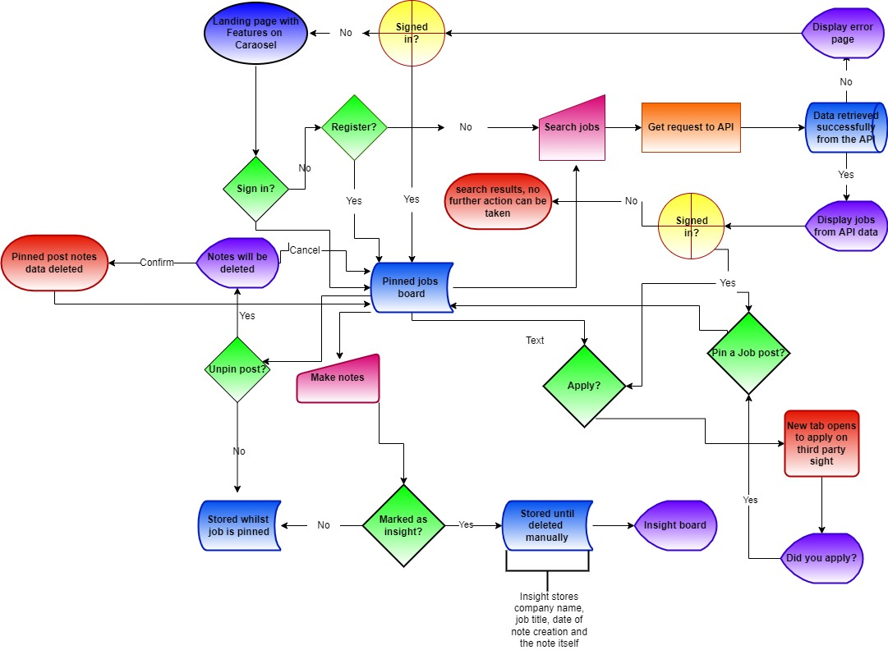

# Jobs-A-Gooden
As a developing developer, within a group of peers, job hunting is something I have found at the forefront of everyone's mind. The app aims to be a proof of concept using a single API to fetch current job roles and provide a method for the user to pin jobs and make notes to track the status of their application processes and any insights gained along the way.

[Deployed site](https://jobs-a-gooden.herokuapp.com/)

## Strategy 
### Site Aims:
On average, it takes a new developer around 20-25 interviews to land their first developer job, and this does not include the total amount of applications sent out but a job seeker.

It can be hard to keep track of job specs when a company responds, especially 
when using multiple sites to check for roles, or worse yet, several months 
have passed since you sent the application.

This app aims to streamline the process by using an  API to search for job posts 
from various companies and once applied for, the job spec would be neatly stored 
to refer back to later. 

Doing this will allow the user to know what is expected during the selection process 
and make it easier for the candidate to research the potential employer upon 
response to their application. The personal board would also allow the user to make 
notes to review their insights of the process and any company feedback.

### Opportunities:
The was a long range of features during my brain storming session for this site. I had to use a feasibility chart to narrow the down and prioritize the scope of the intended strategy. 

Opportunity | Importance | Viability/Feasibility
---|---|---
Job search | 5 | 5
User can pin jobs | 5 | 5
User specific job notes | 5 | 5
Landing page with site overview | 5 | 5
Progress tracker (Kanban board) | 3 | 1
Direct application to jobs | 2 | 1 
Manually add jobs (admin/employer) | 5 | 5
Jobs blog | 1 | 3
Tips/resources | 2 | 4
Personal insights | 5 | 5 
Employer ratings | 1 | 5 
Number of users applied | 1 | 1 
User log in | 5 | 5
Direct email to employer with CV/cover letter attachments | 2 | 1 
Community mentorship | 1 | 1
Freelance specific jobs board | 1 | 1
API to fetch jobs data | 5 | 2 
User profile | 5 | 5
----------------------------------------|----|----
Totals | 59 | 60 

Viability and feasibility in the above table is based on both time and current level of ability using different languages/frameworks. 

## Scope

Due to the imbalance in scores above there will definitely be some tradeoffs, however, I anticipate that there will need to be some trade offs due to the time set for this project. 

I have further divided this table into 3 categories to help prioritize the order of importance and clarify the MVP required to launch as a basic proof of concept whilst meeting the above objective. These three categories are:-
* UX efforts **must** address these:
    * Job search.
    * User can pin Jobs.
    * Landing page with site overview.
    * Manually add jobs (admin/employer).
    * User specific job notes.
    * Personal insights.
    * User login.
    * User profiles.
  
* UX efforts **should** accommodate these:
    * API to fetch jobs data
    * Tips/resources.
    * Progress tracker (Kanban board).
  
* **Unwise** use of time to address there:
    * Direct application to jobs.
    * Jobs blog.
    * Employer ratings.
    * Number of users applied.
    * Direct email to employer with CV/cover letter attachments.
    * Community mentorship.
    * Freelance specific jobs board.

## Structure   
To help me visualize a typical user journey around the site I used [draw.io](https://app.diagrams.net/) to help me plan out the various routes a user could take through the site.

### Flow Charts:

* What state changes need alerts? log in, log out, 404, 500, pop up for apply. 
Make a section in the features with screenshots vut reference this here.

### User Stories:  **STILL TO ORGANIZE PROPERLY**
* As a **User**, I can **access a live url** so that **I can use the site**
* As a **User**, I can **view open job posts** so that **I can decide which ones are of interest to me.**
* As a **User**, I can **type a URL into the web browser** so that **I can access the sites various pages**
* As a **User**, I can **see uniformity on each page, as well as clear, distinguish the content subject** so that **I can easily navigate around the page in a way that feels familiar.**

* As an **Admin** I can...
    * **use a text editor within the admin panel** so that **I can create a job description in a way that is clear and appeals to the eye when creating a job post**    
    * ...**Log into a user interface** so that **I can easily manage data via a user interface**
    * ...**easily navigate the admin panel** so that **I can view, search, add and delete jobs**
    * ...**see an extra button on the jobs page** so that **I can add new jobs from the user interface**
 
* As an **Unregistered User** I can... 
    * ...**quickly determine the subject of the site** so that **from the landing page I can see if I want to continue spending my time on this site and register**
    * ...**register for an account** so that **I can enjoy a personalized experience as a job seeker or employer**
    * ...**browse the available jobs (brief description only)** so that **I can see if I wish to register with the site or not**
  
* As a **Registered User** I can... 
    * ...**create a profile** so that **I can save key details relevant to my job search.**
    * ...**Pin jobs to a board** so that **I can refer back to them later with minimal effort**
    * ...**browse the full details of the available jobs** so that **I can see the full job spec and how to apply**  
    * ...**leave notes specific to the job on my pinboard** so that **I can keep track of specific milestones in the application process**
    * ...**turn a note into an insight** so that **it can be seen on a separate page showing learnings from the entire process of the job hunting process**

## Skeleton
### Wireframes:
* [Homepage wireframes](docs/wireframes/homepage.png)
* [Full job details wireframes](docs/wireframes/job-full-details.png)
* [Job opening page wireframes](docs/wireframes/jobs-openings.png)
* [Pinned jobs page wireframes](docs/wireframes/pinned-jobs.png)

## Surface
### Color scheme:
I used the following [Image](docs/images/jaguar-logo.png) to generate the following color scheme on [coolers.co](https://coolors.co/603f3f-a0acca-e4b67c-de9f13-000000). The resultant color scheme was:

### Typography:

## Data Model
  
[*** REVISED Entity-Relationship-Model***](https://drawsql.app/student-444/diagrams/ci-pp4-job-search/embed)

## Agile development process
For this project I used [JIRA](https://dnlbowers.atlassian.net/jira/software/projects/PJG/boards/4) to track and create issues/user stories. Login credentials for the above project space will be provided along with submission, however, a summery of my agile process/learnings can be found [here](AGILE.md).

## Future development
* automated script to delete/archive hidden job posts by set criteria when actions by admin

## Honorable mentions  

## Credits
* Flow chart symbol meaning taken from [conceptdraw.com](https://www.conceptdraw.com/How-To-Guide/flow-chart-symbols)
* Guidance on file structure for templates folder from [learndjango.com article](https://learndjango.com/tutorials/template-structure)
* [Article on writing good user stories](https://www.industriallogic.com/blog/as-a-developer-is-not-a-user-story/)
* Flow charts made using [draw.io](https://app.diagrams.net/)
* Jaguar cartoon image from [https://favpng.com](https://favpng.com/png_view/jaguar-jaguar-clip-art-vector-graphics-cartoon-illustration-png/yF62hEBm)
* [coolers.co](https://coolors.co/603f3f-a0acca-e4b67c-de9f13-000000) was used to generate color scheme from the jaguar image
* Multiple videos sourced from youtube were used to research a variety of topics:
    * [Programming with Mosh Python Django Tutorial for Beginners](https://youtu.be/rHux0gMZ3Eg)
    * [Django forms with Ajax | How to use ajax with django](https://youtu.be/C4fr3SCqgJQ)
    * [Learn Django - Class-Based Views series](https://youtu.be/ScteNE1jB4g)
* General references:
    * [Geeks for Geeks](https://www.geeksforgeeks.org/)
    * [Stack Overflow](https://stackoverflow.com/)
    * [Code Institute Learning Platform](https://codeinstitute.net/)
    * [Django Documentation](https://docs.djangoproject.com/en/3.2/)
    * [Bootstrap Documentation](https://getbootstrap.com/)