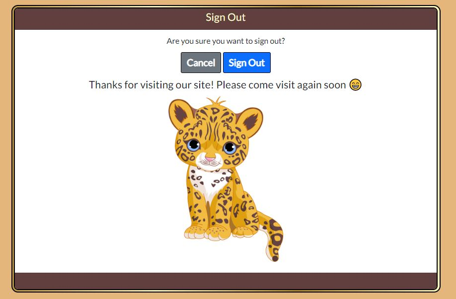

# **Jobs-A-Gooden**
As a developing developer within a group of peers, job hunting is something I have found at the forefront of everyone's mind. 

This site is a community job share platform. It provides a method for users to save a job post and make notes to track their applications. In addition to this, the user can also journal their insights as they progress along the job hunting journey.

[Deployed site](https://jag.dev-bowers.com/)

# **Table Of Contents**
* [**Jobs-A-Gooden**](#jobs-a-gooden)
* [**Planning Phase**](#planning-phase)
  * [**Strategy**](#strategy)
    * [**Site Aims:**](#site-aims)
    * [Opportunities:](#opportunities)
  * [**Scope**](#scope)
  * [**Structure**](#structure)
    * [**User Stories:**](#user-stories)
    * [**User Stories dropped as part of the agile process**](#user-stories-dropped-as-part-of-the-agile-process)
  * [**Skeleton**](#skeleton)
    * [**Wireframes:**](#wireframes)
    * [**Database Schema**](#database-schema)
  * [**Surface**](#surface)
    * [**Color scheme:**](#color-scheme)
    * [**Typography**:](#typography)
      * [***Condiment:***](#condiment)
      * [***Lato:***](#lato)
* [**Agile Development Process**](#agile-development-process)
* [**Features**](#features)
  * [**Site Navigation**](#site-navigation)
    * [**Navbar**](#navbar)
      * [***Logo:***](#logo)
      * [***Signed Out:***](#signed-out)
      * [***Signed In:***](#signed-in)
      * [***Hamburger menu on smaller screen sizes:***](#hamburger-menu-on-smaller-screen-sizes)
    * [**Hero Images:**](#hero-images)
      * [***Job Openings/Landing Page:***](#job-openingslanding-page)
      * [***Add Job Form Page:***](#add-job-form-page)
    * [***Saved jobs page:***](#saved-jobs-page)
    * [***Insights page:***](#insights-page)
    * [***Edit note form page:***](#edit-note-form-page)
  * [**AllAuth Pages**](#allauth-pages)
    * [***Sign In:***](#sign-in)
      * [***Form Errors:***](#form-errors)
    * [***Sign Up:***](#sign-up)
      * [***Form Errors:***](#form-errors-1)
    * [***Sign Out:***](#sign-out)
  * [**Site Instructions**](#site-instructions)
    * [***Access to instructions page:***](#access-to-instructions-page)
      * [***Nav link:***](#nav-link)
      * [***On page Button:***](#on-page-button)
      * [***Note form Anchor tag:***](#note-form-anchor-tag)
  * [**Main Page Content**](#main-page-content)
    * [***Job Openings page:***](#job-openings-page)
      * [***Add Job Button:***](#add-job-button)
      * [***Add Job Form:***](#add-job-form)
      * [***Add Job Success message:***](#add-job-success-message)
    * [***Job Openings and Pinned Board Content:***](#job-openings-and-pinned-board-content)
      * [***Job Preview Card (logged out):***](#job-preview-card-logged-out)
      * [***Job Preview Card (Logged in):***](#job-preview-card-logged-in)
      * [***Job Preview Card Footer (Logged in as admin user):***](#job-preview-card-footer-logged-in-as-admin-user)
    * [***Full Job Details Page***](#full-job-details-page)
      * [***Full details card (unpinned):***](#full-details-card-unpinned)
      * [***Full details card (pinned):***](#full-details-card-pinned)
        * [**Full job card**](#full-job-card)
      * [***Notes form:***](#notes-form)
      * [***Notes Accordion:***](#notes-accordion)
        * [**Note:**](#note)
        * [**Insight:**](#insight)
    * [***Insights PAge:***](#insights-page-1)
      * [***Add Insight Button:***](#add-insight-button)
      * [***Add Insight Form:***](#add-insight-form)
      * [***Add Insight Form Errors:***](#add-insight-form-errors)
        * [**Short description field error:**](#short-description-field-error)
        * [**Short description field error:**](#short-description-field-error-1)
      * [***Insight left success message:***](#insight-left-success-message)
      * [***Insight Item Display:***](#insight-item-display)
      * [***Timeline:***](#timeline)
    * [***Contact Us Page:***](#contact-us-page)
    * [***Pagination:***](#pagination)
    * [***Footer:***](#footer)
  * [**Error pages**](#error-pages)
    * [***Members Only Page:***](#members-only-page)
    * [***500 Server Error Page:***](#500-server-error-page)
    * [***404 Page Not Found Error Page:***](#404-page-not-found-error-page)
  * [**Warning Modals**](#warning-modals)
    * [***Delete Note/Insight:***](#delete-noteinsight)
    * [***Delete Job:***](#delete-job)
    * [***Unpin Job:***](#unpin-job)
    * [***Delete element from the DOM:***](#delete-element-from-the-dom)
* [**Future development**](#future-development)
* [**Testing Phase**](#testing-phase)
* [**Deployment**](#deployment)
* [**Technologies used**](#technologies-used)
* [Honorable mentions](#honorable-mentions)
* [Credits](#credits)

# **Planning Phase**
## **Strategy** 
### **Site Aims:**
It takes a new developer around 20-25 interviews to land their first developer job. Not including the total number of applications sent out by a job seeker.

Keeping track of one's applications can be troublesome. When a company responds, it can be hard to remember the job post requirements, especially when users use multiple sites to check for roles. Worse yet, several months have passed since you sent the application.

This app aims to streamline the process by allowing users to submit a Job advert of interest. Once approved by the admin, the job spec would be neatly stored to refer to later, along with any notes or insights the user wishes to keep. 

Doing this will allow the user to track what is expected during the selection process and make it easier for the candidate to research the potential employer/role upon response to their application. The advert is safely stored on the site. The personal board would also allow the user to make notes to track their application to review their insights of the process and any company feedback provided after an interview.

### Opportunities:
The was an extended range of features during my brainstorming session for this site. I had to use a feasibility chart to narrow it down and prioritize the scope of the intended strategy. 

Opportunity | Importance | Viability/Feasibility
---|---|---
Job search | 5 | 5
User can pin jobs | 5 | 5
User specific job notes | 5 | 5
Landing page with site overview | 5 | 5
Progress tracker (Kanban board) | 3 | 1
Direct application to jobs | 2 | 1 
Manually add jobs (admin/employer) | 5 | 5
Jobs blog | 1 | 3
Tips/resources | 2 | 4
Personal insights | 5 | 5 
Employer ratings | 1 | 5 
Number of users applied | 1 | 1 
User log in | 5 | 5
Direct email to an employer with CV/cover letter attachments | 2 | 1 
Community mentorship | 1 | 1
Freelance specific jobs board | 1 | 1
API to fetch jobs data | 5 | 2 
User profile | 5 | 5
----------------------------------------|----|----
Totals | 59 | 60 

Viability and feasibility in the above table are based on both time and current level of ability using different languages/frameworks. 

## **Scope**

Due to the imbalance in scores above, there will be some trade-offs. However, I anticipate that some further trade-offs will need to be made later due to the time set for this project. 

I have further divided this table into three categories to help prioritize the order of importance and clarify the MVP required to launch as a basic proof of concept while meeting the above objective. These three categories are:-
* UX efforts **must** address these:
    * User can pin Jobs.
    * Manually add jobs (approved only by admin).
    * User-specific job notes.
    * Personal insights.
    * User login.
  
* UX efforts **should** accommodate these:
    * API to fetch jobs data
    * Tips/resources.
    * Progress tracker (Kanban board).
    * User profiles
    * Landing page with site overview.
    * Job search.
  
* **Unwise** use of time to address there:
    * Direct application to jobs.
    * Jobs blog.
    * Employer ratings.
    * Number of users applied.
    * Direct email to an employer with CV/cover letter attachments.
    * Community mentorship.
    * Freelance-specific jobs board.
  
## **Structure**   
To help me visualize a typical user journey around the site, I used [draw.io](https://app.diagrams.net/) to help me plan out the various routes a user could take through the site. This flow changed slightly throughout development, specifically with the dropping of an API for the jobs data. However, in general, it guided the process.
  

  
### **User Stories:**  
  
* As an **Admin** I can...
    * **use a text editor within the admin panel** so that **I can create a job description in a way that is clear and appeals to the eye when creating a job post**    
    * ...**Log into a user interface** so that **I can easily manage data via a user interface**
    * ... **Filter and search all custom models from the admin page** so that **I can utilize the admin page to review, edit and delete data quickly.**
    * ...**Easily navigate the admin panel** so that **I can view, search, add and delete jobs**
    * ...**Approve new job posts offered by the community for the community** so that **I can ensure that posts are not malicious, false, misleading, or incomplete.**
    * ...**Delete a Job post** so that **I can remove jobs that are no longer relevant or available.**
    *  ...**Edit a job post without using the admin panel** to that **if I spot a mistake or update a job post, I can do so quickly and easily without issue.**
 
* As an **Unregistered User** I can... 
    * ...**quickly determine the subject of the site** so that **from the landing page I can see if I want to continue spending my time on this site and register**
    * ...**register for an account** so that **I can enjoy a personalized experience as a job seeker**
    * ...**browse the available jobs (brief description only)** so that **I can see if I wish to register with the site or not**
  
* As a **Registered User** I can... 
    * ...**Pin jobs to a board** so that **I can refer back to them later with minimal effort**
    * ...**browse the full details of the available jobs** so that **I can see the full job spec and how to apply**  
    * ...**leave notes specific to the job on my pinboard** so that **I can keep track of specific milestones in the application process**
    * ...**turn a note into an insight** so that **it can be seen on a separate page showing learnings from the entire process of the job hunting process**
    * ...**delete previous notes and insights** so that **I can delete notes or insights that are no longer relevant to me.**
    * ...**see a timeline of insights** so that **I can track them over time**
    * ...**Add my job posts** so that **I may make notes and insights to track my progress.**
    * ...**edit previously made notes and insights** so that **I may correct mistakes or further elaborate on an existing comment/insights.**
    * ...**See balanced forms with an included text editor for the main field** so that **I can have a pleasant visual experience across the site, and my job post and notes/insight look visually appealing in the style and layout when the submitted data is displayed.**
    * ...**Delete or edit insights from the insights page** so that **I can update or delete insights without job posts no longer visible.**
    * .**Create insights directly from the insights page** so that **I can document my general learning along my career path that may not be specific to a job role advertised on the site.**
 
* As a **Site User** I can...
    * ...**see appropriate responses upon specific interactions with the site** so that **I know my edit, deletion, submission has been successful.**
    * ...**See appealing colors and uniform style themes** so that **every page and part of the process stimulates a positive response.**
    * ...**Access the site from any size screen and still have a pleasant experience on the site** so that **I am not restricted to which devices I can use on the site**
    * ...**access a live URL** so that **I can use the site**
    * **view open job posts** so that **I can decide which ones are of interest to me.**
    * ...**type a URL into the web browser** so that **I can access the site's various pages**
    *  ...**see uniformity on each page and clearly distinguish the content subject** so that **I can quickly and familiarly navigate the page.**
    * ... **Find relevant contact details** so that **I can contact the site admin via email**
  
### **User Stories dropped as part of the agile process**
* As a **Registered User** I can **create a profile** so that **I can save key details relevant to my job search.**

## **Skeleton**
### **Wireframes:**
* [Homepage wireframes](docs/wireframes/homepage.png)  
* [Full job details wireframes](docs/wireframes/job-full-details.png)
* [Job opening page wireframes](docs/wireframes/jobs-openings.png)
* [Pinned jobs page wireframes](docs/wireframes/pinned-jobs.png)
* [insights page wireframes](docs/wireframes/insights.png)

I added a hero image to each page during development and made the Job Opening page the home page. I added some forms to edit notes/insights and add a job; however, these were last-minute additions and were a simple form alone on the page. I deemed there were no wireframes required for these.

### **Database Schema**
Below is my initial plan for my database tables:  
 

My initial plan for my database tables included using a JSON with data from the API. Since I abandoned this idea early on, I replaced the JSON with a jobs model.

I also removed my user model in favor of the default model provided by the ALLAUTH library. I combined the notes and insights tables into a single table with a boolean felid to indicate if the entry was a note or insight.

Below is the final version of the ERD generated via the PGadmin tool connected to my Heroku Postgres database. There are only the three custom tables (Notes, Jobs, PinnedJobs); the rest were generated automatically by various Libraries.

 
Within my models.py, I also have a function using the @receiver decorator to create a PinnedJobs object whenever a user registers; the object is user-specific and links a user to a many2many list of the user's pinned jobs within the PinnedJobs table. Later this can be further developed into a user profile.

## **Surface**
### **Color scheme:**
I used the following [Image](docs/images/jaguar-logo.png) to generate the following color scheme on [coolers.co](https://coolors.co/603f3f-a0acca-e4b67c-de9f13-000000). The resultant color scheme was:

Adapting the above throughout the development process. The final list of colors used has been placed in the below [color grid](https://contrast-grid.eightshapes.com/?version=1.1.0&background-colors=&foreground-colors=%23fcf6ba%2C%0D%0A%23b38728%2C%0D%0A%23fbf5b7%2C%0D%0A%23bf953f%0D%0A%23000%0D%0A%23fffdd0%2C%0D%0A%23fafafa%2C%0D%0A%23603f3f%2C%0D%0A%23fdfd96%2C%0D%0A%23e4b67c%2C%0D%0A%23efefef%2C%0D%0A%23de9f13%2C%0D%0A%23dee2e6%2C%0D%0A%0D%0A%0D%0A%0D%0A%0D%0A%0D%0A%0D%0A%0D%0A%0D%0A&es-color-form__tile-size=compact&es-color-form__show-contrast=aaa&es-color-form__show-contrast=aa&es-color-form__show-contrast=aa18&es-color-form__show-contrast=dnp) to check contrast scores.

### **Typography**:

For this project, I used two different fonts. 
#### ***Condiment:***
* For the J.A.G Logo. I wanted a jagged effect to emphasize the word JAG. 

#### ***Lato:***
* The main font for the remainder of the site. This font was used for its soft edges to match most elements' border-radius attributes.

# **Agile Development Process**
I used [JIRA](https://dnlbowers.atlassian.net/jira/software/projects/PJG/boards/4/roadmap) to track and create issues/user stories. I will provide login credentials for the above project space when submitting the project. However, you can find a summary of my agile process/learnings [here](AGILE.md).
  
# **Features**
## **Site Navigation**
### **Navbar**
#### ***Logo:***
When brainstorming names for the site, the phrase "Jobs A Gooden" came to mind when thinking about finding the perfect job; this term gave rise to the acronym J.A.G. For this reason, I used the below image as the logo/mascot of the brand.

The Font used was a cursive style on purpose because of the jagged appearance it gave the text.  
  

  
#### ***Signed Out:***
The navbar allows the user to navigate the site easily. When signed out of the page, it shows the following:
* Shows link to register.
* Shows login link.
* Jobs and Tracking dropdown menus are disabled and show a different color than the other nav items.
* Logo with company acronym and mascot. The logo also serves as a link back to the home page at any point in the user's journey.  

  
#### ***Signed In:***
Changes to the nav bar when logged in are:
* Register and Login nav items replaced with Logout.     
  
  
* Jobs and Tracking dropdowns are now clickable, and the color matches the other nav items.
      
    
  
#### ***Hamburger menu on smaller screen sizes:***
To display the menu properly on smaller screen sizes, a burger menu was implemented using bootstrap.  
   
 
  
### **Hero Images:**
I picked the hero images to portray the page's theme to the user. 
#### ***Job Openings/Landing Page:***
I wanted something that inspired the user in their job search for this page. The neon sign saying "Do something great" aligns with the people I spoke to when researching what a user would want out of a job. Out of the five people I asked, "Why did you decide to change jobs last?" 4 said they wanted a career that felt more fulfilling for them and had an impact. The chosen image was to personify this desire.  
  

#### ***Add Job Form Page:***
I wanted an image that invoked a positive feeling for both users and employers, adding a job to share with the community.
  

  
### ***Saved jobs page:***
The chosen image shows a man sticking posits to the wall and making notes to track their ideas. I felt this nicely personified the site's intention to save jobs and make notes as a user brainstorms and tracks the journey of their future career path.

  
### ***Insights page:***
This hero image sticks with the inspirational theme. The words "Lets your intuition guide you. You are what you have been looking for" are displayed on a pamphlet. There is some [debate in the psychological community](https://www.ncbi.nlm.nih.gov/pmc/articles/PMC5020639/#:~:text=Intuition%20and%20insight%20are%20intriguing%20phenomena%20of%20non-analytical,by%20recombining%20the%20single%20elements%20of%20a%20problem.) over the differences between insights and intuition as a type non-analytical mental functioning. However, the common perception is that intuition precedes insight, and for this reason, it seemed fitting to place this inspirational quote on the insights pages.  
  

  
### ***Edit note form page:***
I chose an image of a person making notes in a copybook for this page.
  

## **AllAuth Pages**
### ***Sign In:***

  
#### ***Form Errors:***

  
### ***Sign Up:***

#### ***Form Errors:***

### ***Sign Out:***

  
## **Site Instructions**
  

  
### ***Access to instructions page:***
There are three ways a user can access the site instructions detailing how to use the site's primary feature of tracking a job search journey. 
#### ***Nav link:***
  
  
#### ***On page Button:***
There is a button linking the user to the site instructions at the top of the pages main content on the following pages:-
* Job Openings.
* Saved Jobs/Jobs Pinboard page.
* insights page.  
  

#### ***Note form Anchor tag:***
  
  
  
## **Main Page Content**
### ***Job Openings page:***
#### ***Add Job Button:***

  
#### ***Add Job Form:***
* Allows a user to submit a job post for admin approval.
  

  
#### ***Add Job Success message:***
* Once added, the user will see an alert advising them that the job post has been submitted and is awaiting admin approval.
* Can cancel the form without the need to complete it.     

  
### ***Job Openings and Pinned Board Content:***
#### ***Job Preview Card (logged out):***
* Visible only from the job openings page.
* Toggle disabled.
* Button for full job spec invites the user to log in or sign up.
* Company name, role, location, salary info, and expiry date visible.
    
  
  
#### ***Job Preview Card (Logged in):***
* Only saved jobs will be visible on the jobs pinboard page.
* From the pinboard page, it will disappear if a post gets unpinned. The remaining jobs will take up the vacated space.
* Toggle active.
* When a job is pinned, the toggle goes to the right, and the background turns green.
* When a job is unpinned, the toggle goes to the left, and the background turns white.
* Button for full details clickable and directs the user to the full job spec.
* Company name, role, location, salary info, and expiry date visible.
  
  

#### ***Job Preview Card Footer (Logged in as admin user):***
* Edit button visible for easy editing of a job post.
* Delete button visible for easy deletion of a job.
* Closing date for job role visible.  
   
  
  
### ***Full Job Details Page***
#### ***Full details card (unpinned):***
* Shows all relevant felids of the job entry.
  

  
#### ***Full details card (pinned):***
##### **Full job card**
* Toggle turns green and to the right.
* Card width narrows when wider screens to allow for notes section.
   

  
* On narrower screens, card width stays the same, and the button shows to scroll to the notes section instead.  
  

  
#### ***Notes form:***
* Displayed to the right of the job card on wider screens.
* Displayed underneath job card on narrower screens.  
  
  
* Error displayed if the short description or note field is left blank.  

  
* Success message is shown upon successful submission of a note/insight.  

  
#### ***Notes Accordion:***
* Notes and insights are displayed here in the accordion, located under the note form.
* Deletions occur without page refresh
* When leaving a note, the page redirects to a new URL to prevent a note from being left twice by refreshing the page.  
  
  
  
##### **Note:**
* When a user unpins a job, their related notes get deleted to prevent a clog up of old data in the database. 
* Date created is visible.
* White background.
* Edit button available to edit note.
* Delete button available to delete note.
  
  
  
##### **Insight:**
* Will be saved even if the job is unpinned.
* Date created is visible.
* Light bulb icon next to the short description indicates the note is an insight.
* Yellow background.
* Edit button available to edit insight.
* Delete button available to delete insight.
* Noted "marked as insight" in the top right of the body.
  
 
  
### ***Insights PAge:***
#### ***Add Insight Button:***
Allows the user to add insights without a related job.  
  
 
  
#### ***Add Insight Form:***
* Form allows users to create insights with no related job post.
* Related_job field is automatically set to null.
* is_insight is automatically set to true when using this form and cannot be changed by the user.  
  
 
  
#### ***Add Insight Form Errors:***
When a form submission is invalid, errors are shown to guide the user.
  
##### **Short description field error:**
  
  
  
##### **Short description field error:**  
  
  
    
#### ***Insight left success message:***
  
Once submitting an insight from the insight page, a success message displays on the insights page.
  

  
#### ***Insight Item Display:***
  
* Insight item displayed with date created.
* Short description and note field visible.
* Button to edit an entry.
* Button to delete the entry. 
   

  
#### ***Timeline:***
  
Acts as a central focal point for insights, so they display on alternate sides is in the order from newest to oldest.  
  

On narrower devices, the insights stack on top of each other:  
   

### ***Contact Us Page:***
  
* Fake email address to contact site admins (In the future, I will be looking into domain names)
* Navigation button to the job openings page.
* Navigation button to the job pinboard page.    
  

  

### ***Pagination:***
It appears on the following pages when:
  * Job Openings page when more than six items are to be displayed.
  * Job pinboard page when more than six items are to be displayed.
  * Insights page when more than four items are available.  

### ***Footer:***
* Displays page copyright.
* Displays social media links to contact the author.  
  

## **Error pages**
The below error pages were created out of necessity. A user could still access some pages when logged out. Other pages would show an error due to the logic on the page needing a user object to render the logic from the view.
  
My initial solution was for this was a members-only page when a user was not logged in. However, due to some URLs being linked to views requiring user-specific data, a default 500 error would be shown. I decided to handle this with a customized error page.
  
### ***Members Only Page:***

The members-only page is visible when logged out and trying to access the below pages via the URL:
* Full job spec page.
* Edit note/insight form page.
* Add job form.
* Add insights form.
  

### ***500 Server Error Page:***
The 500 error page appears on those URLs linked to views requiring a user object to function. It can cover other scenarios in the future; however, after extensive manual testing, this was the only trigger I found for this page.

Pages where the error shows when trying to access a page via the URL when logged out:
* Job pinboard page.
* Insights page.
  

### ***404 Page Not Found Error Page:***
This error shows when a user types a URL into the browser which does not exist within the app's domain.

## **Warning Modals**
### ***Delete Note/Insight:***

  
### ***Delete Job:***

### ***Unpin Job:***

### ***Delete element from the DOM:***
Once deleting a job or unpinning a job, the element is hidden with javascript, and then the page refreshes to fill the vacant spot as the page rerenders. I took the approach of hiding the element first on list views to prevent the user from re-pinning the post before it refreshed. After removing the element, a refresh was required for the other elements to fill the page's space and prevent pagination issues.

# **Future development**
* Automated script to delete/archive hidden job posts by set criteria when actions by admin.
* Build an online community.
* Job categories
* Search feature
* API for a Job's site
* Auto email to Job post author when a job is close to expired that it will be deleted after the specified expiration time.
* [KanBan board](https://codepen.io/josetxu/pen/VwyxZKq) to track applied, round, and response.
* The ability for the user to keep their added posts private, visible only on their saved jobs board. Currently, hiding a job in this way is only possible if the admin pins the post on the user's behalf from the admin panel. 
* Counter on admin's delete job button, which shows the number of users with the job pinned. Preventing the Admin from having to check the admin panel for this info prior to deleting the job.

# **Testing Phase**
I have included testing details during and post-development in a separate document called [TESTING.md](TESTING.md).

# **Deployment**
The final Deployed site can be found [here](https://jobs-a-gooden.herokuapp.com/)
I have included details of my initial deployment in a separate document called [DEPLOYMENT.md](DEPLOYMENT.md).

# **Technologies used**
* Python
  * The packages installed for the is project can be found in [the requirements.txt](requirements.txt)
* Django
  * Django was used as the python framework in the project.
  * Django all auth was used to handle user authentication and related tasks i.e. sign in, sign up, sign out.
* Heroku
  * Used to deploy the page and make it publicly available.
* Heroku PostgreSQL
  * Used for the database during development and in deployment.
* HTML
  * HTML was the base language used to layout the skeleton of all templates.
* CSS
  * Custom CSS used to style the page and make the appearance look a little more unique.
* Javascript
  * I have used Javascript throughout to manipulate the DOM and communicate to the backend to create, read, update, and delete data from the database.
* Jinja
  * Jinja was the templating language used in order to implement the views.py logic and models.py data into a template so it could be displayed to the user.
* Bootstrap 5.1.3
  * Used to style HTML, CSS, minor javascript. The more I used this framework the most I realized retrospectively how it could have saved me writing several parts of the code I had already written.
* Font awesome
  * All icons throughout the page.

# Honorable mentions  
* [Richard Wells](https://github.com/D0nni387) - Mentor extraordinaire. He was ways on call when I needed him and never afraid to pull out the big guns to push that little bit further.
* [Sean Murphy](https://github.com/nazarja) - Just a legend, any way you slice it, he helped me understand the logic behind my pin job feature by providing examples of similar things and helped me to connect to Heroku through the console of VSCODE
* [Matt Bodden](https://github.com/MattBCoding) - The comfort of a friend no matter the time of day, the push of a competitor even if I was not playing the game.
* [Steve Wier](https://github.com/StevenWeir038) - A man and a legend in his own right. Always checking in on me and testing my work. Pushing me to move forward even when I did not feel like it.
* Guillermo Brachetta - Explained dotenv package and how to use it.
* Ed_CI - was always there in the project channel and quick to jump in to help
* [Megan Vella](https://github.com/Medusas71) - Gave me the most extensive testing review of the lot. Always quick to say hello and look for ways to help.
* Daniel Callaghan - Always hanging out in the PP4 channel and quick to answer any call for help.

* The code institute Slack community as a whole who tested and supported me throughout. There have been too many to mention everyone who encouraged along the way, but they are all superstars.

* And the biggest thanks goes to my wife and child, who have had to deal with me face to face through it all. Oliver has been my reason for the change, and Analise my inspiration. 
  
# Credits
* Balsamiq was used to create the wireframes.
* The site was developed using VScode.
* GitHub was used to store my repository.
* Responsive screenshot made using [techsini.com](https://techsini.com/multi-mockup/index.php)
* Flow chart symbol meaning taken from [conceptdraw.com](https://www.conceptdraw.com/How-To-Guide/flow-chart-symbols)
* Guidance on file structure for templates folder from [learndjango.com article](https://learndjango.com/tutorials/template-structure)
* [Article on writing good user stories](https://www.industriallogic.com/blog/as-a-developer-is-not-a-user-story/)
* Flow charts made using [draw.io](https://app.diagrams.net/)
* [coolers.co](https://coolors.co/603f3f-a0acca-e4b67c-de9f13-000000) was used to generate color scheme from the jaguar image
* [W3cschool](https://www.w3schools.com/howto/howto_css_timeline.asp) was used to source the majority of the code used to create a timeline in CSS for the insights page. Minor styling adjustments were made and the HTML was adapted to include a Jinja for loop to display the relevant data without code repetition.
* [CSEStack](https://www.csestack.org/display-messages-form-submit-django/) to research using messages upon form submission.
* The PageTitleViewMixin was taken from [djangoforge.com](https://www.djangoforge.dev/guides/page-titles/)
* How to handle exceptions [studygyann.com](https://studygyaan.com/django/django-custom-404-error-template-page)
* The golden gradient color scheme - [brandgradients.com](http://www.brandgradients.com/gold-gradient).
* Fonts were taken from [Google Fonts](https://fonts.google.com/)
* Images:
  * Hero images taken from [upsplash.com](https://unsplash.com) 
  * Jaguar cartoon image from [https://favpng.com](https://favpng.com/png_view/jaguar-jaguar-clip-art-vector-graphics-cartoon-illustration-png/yF62hEBm)
* Multiple videos sourced from youtube were used to research a variety of topics:
    * [Programming with Mosh Python Django Tutorial for Beginners](https://youtu.be/rHux0gMZ3Eg)
    * [Django forms with Ajax | How to use ajax with django](https://youtu.be/C4fr3SCqgJQ)
    * [Learn Django - Class-Based Views series](https://youtu.be/ScteNE1jB4g)
* General references:
    * [Geeks for Geeks](https://www.geeksforgeeks.org/)
    * [Stack Overflow](https://stackoverflow.com/)
    * [Code Institute Learning Platform](https://codeinstitute.net/)
    * [Django Documentation](https://docs.djangoproject.com/en/3.2/)
    * [Bootstrap Documentation](https://getbootstrap.com/)
    * [Jinja Template Documentation](https://jinja.palletsprojects.com/en/3.0.x/templates/)