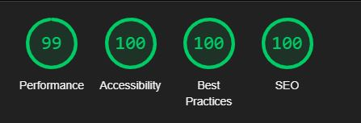

# Manuel Testing
* [Manuel Testing](#manuel-testing)
  * [Bugs and Fixes During the Development Process](#bugs-and-fixes-during-the-development-process)
* [Wave Aim Accessibility checker:](#wave-aim-accessibility-checker)
* [Lighthouse](#lighthouse)
  * [Job Openings](#job-openings)
    * [Logged out:](#logged-out)
      * [*Desktop*:](#desktop)
      * [*Mobile*:](#mobile)
    * [Logged in:](#logged-in)
      * [*Desktop*:](#desktop-1)
      * [*Mobile*:](#mobile-1)
  * [Full Job Spec](#full-job-spec)
    * [With Notes Displayed:](#with-notes-displayed)
      * [*Desktop*:](#desktop-2)
      * [*Mobile*:](#mobile-2)
    * [No Notes Displayed:](#no-notes-displayed)
      * [*Desktop*:](#desktop-3)
      * [*Mobile*:](#mobile-3)
  * [Saved Jobs](#saved-jobs)
      * [*Desktop*:](#desktop-4)
      * [*Mobile*:](#mobile-4)
  * [Tracking Instructions Page](#tracking-instructions-page)
      * [*Desktop*:](#desktop-5)
      * [*Mobile*:](#mobile-5)
  * [Contact Page](#contact-page)
      * [*Desktop*:](#desktop-6)
      * [*Mobile*:](#mobile-6)
  * [Insights Page](#insights-page)
      * [*Desktop*:](#desktop-7)
      * [*Mobile*:](#mobile-7)
  * [Add Insights Page](#add-insights-page)
      * [*Desktop*:](#desktop-8)
      * [*Mobile*:](#mobile-8)
  * [Edit Notes Page](#edit-notes-page)
      * [*Desktop*:](#desktop-9)
      * [*Mobile*:](#mobile-9)
  * [Add Job Page](#add-job-page)
      * [*Desktop*:](#desktop-10)
      * [*Mobile*:](#mobile-10)
  * [Sign Out Page](#sign-out-page)
      * [*Desktop*:](#desktop-11)
      * [*Mobile*:](#mobile-11)
  * [Sign in Page](#sign-in-page)
      * [*Desktop*:](#desktop-12)
      * [*Mobile*:](#mobile-12)
  * [Sign up Page](#sign-up-page)
      * [*Desktop*:](#desktop-13)
      * [*Mobile*:](#mobile-13)
* [Validators](#validators)
  * [HTML:](#html)
  * [CSS:](#css)
  * [JS:](#js)
  * [PEP8:](#pep8)
* [Manual testing](#manual-testing)
  * [As an **Admin** I can...](#as-an-admin-i-can)
  * [As an **Unregistered User** I can...](#as-an-unregistered-user-i-can)
  * [As a **Registered User** I can...](#as-a-registered-user-i-can)

## Bugs and Fixes During the Development Process
Below is a list of bugs and fixes found while creating a feature. You can find other bugs as bug tickets in [JIRA(https://dnlbowers.atlassian.net/jira/software/projects/PJG/issues/PJG-57?jql=project%20%3D%20%22PJG%22%20AND%20type%20%3D%20%22Bug%22%20ORDER%20BY%20created%20DESC)]. The Jira tickets are bugs found after I concluded the sprint including this feature because during the feature creation I missed the bugs.

* Issue - On the epic called "initial deployment,"  the final user story was to deploy to Heroku. When deploying, I got an application error when loading the app on Heroku.
* Cause - Checking the logs via the Heroku console, I could see it was having issues when looking for the .env file. I purposely did not track this file to protect sensitive data such as the SECRET KEY and other privileged information, which one should never store publicly on GitHub. 
* Solution - As a result, I had to add a conditional statement to import the .env file containing the config vars required to run this application from my local machine. If the file exists, the basis of this conditional was to run the app using the contained config variables; if the file does not exist, it would skip the import process entirely and take the config vars entered on the Heroku app settings instead.

* Issue - When I pushed my code to GitHub, it detected I had installed  Django 3.2 from the requirements.txt; however, without the latest security patches.
* Cause - I used the Code institute recommended pip install Django==3.2 gunicorn command to install Django during the initial deployment. This installation did not include the latest security patches.
* Solution - I upgraded to the latest patch of this Django version with "pip install --upgrade django==3.2.12," and the error disappeared. Later the same issue occurred with version 3.2.12, and it was required to upgrade Django again to version 3.2.13

* Issue - early in the project, I found that most job APIs required O-auth, which did not match my current understanding of the taught fetch method. I found reed employment had an API that used basic authentication; however, it was getting blocked when using it from my localhost.
* Cause - Lack of understanding of using APIs requiring Oauth authentication.
* Solution - Since this was early in the project, I decided not to spend much time on it. I was able to pull the data using the endpoint and API key in the browser address bar and saved that data to a JSON file. The JSON would serve as test data to build the site, and I would come back to the API issue at a later stage. (Later abandoned as part of the agile process in favor of a community job share site, I will look to implement an API again in the future)

* Issue - I had trouble inserting my card component from the job_search app into the required job-list page.
* Cause - At first, I thought it was a file path issue; however, after much research, I found [this article](https://www.geeksforgeeks.org/include-django-template-tags/) showing quotation marks surrounding the file path of the include property.
* Solution - Adding the quotation marks around the correct relative file path resolved the issue.

* Issue - Linking my custom base.html in the AllAuth template was not working no matter what file path I was using.
* Cause - My file structure using base.html only in the extends property was not enough; after much dead-end research, I looked at the AllAuth views file to see where it was looking for the templates and saw it was checking the settings file.
* Solution - By adding os.path.join(BASE_DIR, 'templates', 'packages/allauth'). I was able to redirect the project to look here for AllAuth templates and enabling me to keep my packages separate from my custom code.

* Issue - Errors on Postgres database migrations.
* Cause - while coming to terms with how to use the model portion of Django, I recreated the models multiple times; this caused various errors when migrating changes to the database.
* Solution - I deleted the Postgres database from Heroku and my migration files and added a new Postgres server to Heroku. I then re-ran the migration commands to start the database over from scratch. Once migrated, I also needed to re-add the job data and recreate the superuser for testing purposes.

* Issue - Without touching my code between coding sessions, I had an error message saying it could not connect to my Heroku Postgres server database when running the server locally. 
* Cause - Due to an [Heroku maintenance](docs/images/heroku-maintenance.jpg), my DATABASE_URL had changed, causing my local .env file to be out of date. 
* Solution - Updating the DATABASE_URL resolved the issue with running the server locally. This

* Issue - Pinned jobs are not visible on the job list page but as pinned in the full job spec.
* Causes - I tried to use a form with a hidden submit button and use JS to hit the button on click of the pin job toggle. a Django form used in this manner caused issues in that I could not retrieve the data from the generic list view on the job list page. I could not see which Jobs as pinned unless on the full job post itself.
* Solution - I abandoned using a Django form, so I decided to use the Javascript fetch method to handle the post request instead. However, the new method caused the issue to resolve, giving rise to the below bug.

* Issue - Pinned jobs displayed correctly on all pages, but I could not edit from the full job spec page.
* Cause - When attempting to toggle the job is_pinned status from the full job details page, it was adding /pinned/{job.id} to the end of the URL already containing the job id, causing a 404 error.
* Solution - adding "../" to the start of the fetch URL in the javascript file allowed the toggle to always start from the root URL when updating the pinned job status. 

* Issue - Bootstrap accordion was not closing a section when opening a new one.
* Cause - I failed to match the accordion ID with the data-bs-parent when tailoring the bootstrap code.
* Solution - Once I set these two attributes to the same ID, the accordion opened and closed as expected, one section at a time.

* Issue - Notes left were not user-specific, and all users could see all notes.
* Cause - I had not defined a variable in the view, which allowed me to use the logged-in user as part of the conditional in the template.
* Solution - By setting the author variable in the views.py, I matched the requesting user id in the Notes model to show the user their notes exclusively.

* Issue - If refreshing after submitting a note, a duplicate note got added to the database.
* Cause - Page was refreshing but not redirecting upon submission
* Solution - By adding ```return HttpResponseRedirect(reverse('note_made', args=[id]))``` after the form save which points to a new URL path upon submit, this fixed the issue of resubmitting the same form inputs twice.

* Issue - Pagination not working when displaying the job preview cards on the pinned posts page.
* cause - I initially created a functional view to display pinned posts that did not allow pagination.
* Solution - Using the generic class ListView with get_queryset to add the additional information required to render this feature using a generic class view.    

* Issue - Notes and pinned job posts remained until the page refreshed, even when deleted/unpinned.
* Cause - The pinned variable from the views required a page refresh to update the DOM. 
* Solution - By adding Jquery to show and hide the element, I made the toggle affect the DOM dynamically to display and hide the note section.

* Issue - When entering a pinned Jobs post full spec page, the notes section was hidden until unpinned and pinned again.
* Cause - I had made the notes section display none and removed the default to hide it when unpinned. 
* Solution - I added two bootstrap classes that hold the properties display inline if the job is_pinned, and if the job is_pinned equaled false, the property was displayed none. I chose to use custom classed over the bootstrap classes d-none and d-inline so that they did not interfere with the display of any property applied by the jquery hide property.

* Issue - When unpinning a job post from the saved jobs page, there was a gap left where the hidden element resided. Furthermore, removing multiple jobs at once caused issues with the pagination.
* Cause - Setting the generic class to paginate by 6, once the user removed enough posts and pressed the "next button, the "if paginated" condition was no longer True, causing a page not found error.
* Solution - By forcing the page to refresh with javascript after hiding the element, this caused the pinned posts to shuffle across when the page reloaded, meaning there would always be six pinned jobs per page, providing there were 6 to display.
 
* Issue - Notes and the pinned post remained until the page refreshed, even when deleted/unpinned.
* Cause - The logic retrieved the displayed data in the view only upon page refresh.
* Solution - Using Javascript to force a refresh after unpinning each job ensured that the elements filled all space on the page until only five or fewer entries remained to be displayed.

* Issue - using bootstrap alerts to display appropriate alerts to the user upon form submission was not displaying correctly.
* Cause - The original logic in the view was having trouble passing a success message when leaving a note or insight and redirecting pages(my solution to form duplication on page refresh). 
* Solution - After some research, I discovered a specific [message method](https://www.csestack.org/display-messages-form-submit-django/) for Django to use in unison with bootstrap alerts. Applying this resolved the issue.

* Issue - There was a console error on pages where the warning modal did not exist.
* Cause - Event listeners did not load for the modal regardless of whether the modal was present. Loading the events at the document's start caused the browser to say it could not find various buttons when loading "warningModalEvents()."
* Solution - The console error disappeared by adding a truthy conditional statement to check if the modal was present before firing the event listener function. These event listeners would only load when the browser found the modals ID attribute.
 
* Issue - When on page two or more of a paginated page and removing items from it, a page not found error can occur if no more items remain on the page.
* Cause - The pagination feature is such that the last page can only exist if there are more items than the set "paginate_by" value. Removing surplus items causes the page not to exist.
* Solution - By using javascript, I checked when the relevant list node was equal to 1 and used this to trigger a function that takes the last digit from the URL and subtracts one before redirecting the user to the previous page.

* Issue - Page not found error when on page 1 and removing all the items.
* Cause - My previousPageRedirect function created in the above bugfix changed the page to page 0 when removing all the items from page 1.
* Solution - Added an extra conditional to this function so it would not go below page 1 or reduce the page number if, by subtracting one, the result was NaN

* Issue - While testing the solution of bug fix ticket PJG-55, I found that when deleting insights from the insights page, they were not disappearing when the page refreshed.
* Cause - The delete note function was not applicable for the DOM on the insight page, so although I  removed the insight from the database, the item was still visible from the insights page.
* Solution - Creating a separate function similar to deleteNote for deleteInsight allowed me to traverse the DOM and remove elements from the timeline at the time of deletion.

* Issue - When registering with an email, a 500 error was displayed.
* Cause - I was missing several settings for all auth in my setting.py
* Solution -  I added the additional settings required in settings.py to handle an email on signing up for the issue.

# Wave Aim Accessibility checker:
* Found a contrast error on the disabled dropdown buttons in the navbar. Due to the buttons not being accessible until logged in, I deemed fixing this unnecessary. I fixed this by changing the default color of a disabled nav-link item provided by bootstrap so something more visible yet still darker than the cream color used by active links.  
   
* There was an accessibility issue due to the label for the pin jobs toggle. Setting this to display none and adding some text in the tags resolved this. Later during the lighthouse checks below, I added an aria label to the toggle, which fixed the lighthouse score for accessibility.

# Lighthouse
The lighthouse test showed a reduced score for accessibility on pages with a toggle switch. The error was "Form elements do not have associated labels." I fixed this by adding an aria-label to the pin jobs toggle. 

The lighthouse score also confirmed the poor contrast scores on the navbar items that are disabled when signed out.

In general Mobile scores were lower in performance for two main reasons, cdn imports from bootstrap, jquery, and the already compressed (multiple times hero images). As a future development, I would be looking to reduce load time by replacing the few lines of jquery in my custom JS file with vanilla JS instead.

## Job Openings 
### Logged out:
#### *Desktop*:


#### *Mobile*:


### Logged in:
#### *Desktop*:


#### *Mobile*:


## Full Job Spec 
### With Notes Displayed:
#### *Desktop*:

* Reduction in accessibility score due to no title on the summer note iframe. 

#### *Mobile*:


### No Notes Displayed:
#### *Desktop*:


#### *Mobile*:


## Saved Jobs
#### *Desktop*:


#### *Mobile*:


## Tracking Instructions Page
#### *Desktop*:


#### *Mobile*:


## Contact Page
#### *Desktop*:


#### *Mobile*:


## Insights Page
#### *Desktop*:


#### *Mobile*:


## Add Insights Page
#### *Desktop*:

* Reduction in accessability score due to no title on the summernote iframe.

#### *Mobile*:


## Edit Notes Page
#### *Desktop*:

* Reduction in accessability score due to no title on the summernote iframe. 

#### *Mobile*:


## Add Job Page
#### *Desktop*:

* Reduction in accessability score due to no title on the summernote iframe. 

#### *Mobile*:


## Sign Out Page
#### *Desktop*:


#### *Mobile*:


## Sign in Page
#### *Desktop*:

* Reduction in accessability score due to Contrast on disabled navbar buttons

#### *Mobile*:


## Sign up Page
#### *Desktop*:

* Reduction in accessability score due to Contrast on disabled navbar buttons

#### *Mobile*:


# Validators
## [HTML](https://validator.w3.org):

All pages were free from errors, except those noted below.

* When validating pages rendering text created using the summer note editor, there was an extra <p> tag surrounding the summer note content. The tag was not visible to the users but was picked up by the validator and resolved by removing the surrounding paragraph tag when rendering a summer note field as part of a form.  

 

* I found further errors coming from summer notes on pages containing a form using the editor within it. I had tried several ways to resolve this, including getting rid of the default iframe; however, it appears there is a known issue when setting the SUMMERNOTE_CONFIG to 'iframe':False that the editor no longer shows. I could not find any workable solution; however, since there was no direct impact on the user, I decided to leave this for now.  


## [CSS](https://jigsaw.w3.org/css-validator/):
Checking by URL there were a lot of errors coming from the bootstrap and font awesome source code.  However my CSS file was tested by direct upload was found to be free from errors
<p>
    <a href="http://jigsaw.w3.org/css-validator/check/referer">
        
    </a>
</p>

## [JS](https://jshint.com/):
JShint found only missing semi-colons, which I have since added where appropriate.  


## [PEP8](http://pep8online.com):
Before using the pep8 validator I ran ``` autopep8 --in-place --aggressive --aggressive <file name> ``` on all py files.  

Due to this, the only error I found was in settings.py with ``` AUTH_PASSWORD_VALIDATORS ``` & ``` STATICFILES_STORAGE ```.   

 

The first appears to be a long-standing issue with using the pep8 checker with Django, and there have been some [suggest resolves](https://code.djangoproject.com/ticket/28163). However, Django seems to think shortening these lines is ill advisable. For this reason, I left them to be longer than 80 characters. 

# Manual testing
Below is a summary of how I manually tested each user story.

## As an **Admin** I can...

Here I have only tested the admin panel relating to the JOB_SEARCH app, as the other sections relate to imported libraries.

| Checked | ...**use a text editor within the admin panel** so that **I can create a job description in a way that is clear and appeals to the eye when creating a job post** |
|:-------:|:--------|
| &check; | Can add a job post successfully from the admin panel using the summer note editor |

| Checked | ...**Log into a user interface** so that **I can easily manage data via a user interface** |
|:-------:|:--------|
| &check; | Can Log in to admin panel successfully |
| &check; | Changes to any data are reflected in the database |

| Checked | ... **Filter and search all custom models from the admin page** so that **I can utilize the admin page to review, edit and delete data quickly.** |
|:-------:|:--------|
| **Jobs** |  |
| &check; | Can search keywords job by company name |
| &check; | Can search keywords job by job title |
| &check; | Can filter by a user to see which jobs they have pinned |
| &check; | Can filter by Company name to see all jobs related to them |
| &check; | Can filter by job title to see common job posts |
| &check; | Can filter by date posted to see recent posts |
| &check; | Can filter by date expired to see jobs recently expired |
| &check; | Can filter by status to see hidden/public jobs |
| &check; | Can filter by approved to know what needs approving still |
| &check; | Can filter by username and see their pinned jobs  |
| **Notes** |  |
| &check; | Can search username |
| &check; | Can search related job |
| &check; | Can filter by a user to see on which jobs they made notes |
| &check; | Can filter by related job to see which users have notes/insights on that role |
| &check; | Can filter by is_insight to feature is being used |
| &check; | Can filter by date created  |
| &check; | Short description is not visible to the admin to protect the user's privacy   |
| &check; | Note content is not visible to the admin to protect the user's privacy   |
| **Pinned Jobs** |  |
| &check; | Can search username |
| &check; | Can filter by a user to see which jobs they have pinned |

| Checked | ...**Easily navigate the admin panel** so that **I can view, search, add and delete jobs** |
|:-------:|:--------|
| &check; | Can add a job |
| &check; | Can delete an individual job |
| &check; | Can delete multiple jobs at once |
| &check; | Can search keywords job by company name |
| &check; | Can search keywords job by job title |
| &check; | Can view a job post |
| &check; | Any changes to data are reflected in the database |

| Checked | ...**Approve new job posts offered by the community for the community** so that **I can ensure that posts are not malicious, false, misleading, or incomplete.** |
|:-------:|:--------|
| &check; | Can approve a job individually from within the job post |
| &check; | Can approve jobs on mass from the main jobs list page |
| &check; | Change in the approved field is reflected in the database table for the specific job |

| Checked | ...**Delete a Job post** so that **I can remove jobs that are no longer relevant or available.** |
|:-------:|:--------|
| &check; | Can delete from the front end |
| &check; | Delete button only visible on the front end for admin staff |
| &check; | Warning to check if the user has the post pinned before deletion from the front end |
| &check; | Can hide from the admin panel so post still visible on users pinboard |
| &check; | hidden post still visible on users pinboard when set to hidden |
| &check; | Deletion is reflected in the database |

| Checked | ...**Edit a job post without using the admin panel** to that **if I spot a mistake or update a job post, I can do so quickly and easily without issue.** |
|:-------:|:--------|
| &check; | Can edit from the front end |
| &check; | Edit button only visible on the front end for admin staff |
| &check; | Can cancel the edit |
| &check; | Can save the edit |
| &check; | Edit is reflected in the database |


## As an **Unregistered User** I can...

| Checked | ...**quickly determine the subject of the site** so that **from the landing page, I can see if I want to continue spending my time on this site and register** |
|:-------:|:--------|
| &check; | Can see the theme of the site from the landing page  |
| &check; | Can access the instructions to understand better what I can do if I register |

| Checked | ...**register for an account** so that **I can enjoy a personalized experience as a job seeker** |
|:-------:|:--------|
| &check; | Can sign up for a new account with email  |
| &check; | Can sign up for a new account without email  |
| &check; | Logged in and get redirected to the landing page upon successful signup |
| &check; | Able to start using the site features immediately |
| &check; | New user entry visible from the database after registration |
| &check; | Unable to register with a duplicate email or username |

| Checked | ...**browse the available jobs (brief description only)** so that **I can see if I wish to register with the site or not** |
|:-------:|:--------|
| &check; | Can see the preview cards for available jobs  |
| &check; | Can see I need to sign up/log in to see more info |

## As a **Registered User** I can... 

| Checked | ...**Pin jobs to a board** so that **I can refer back to them later with minimal effort** |
|:-------:|:--------|
| &check; | Can pin a job post from the job opening page  |
| &check; | Once pinned, they are visible on the saved jobs page |
| &check; | Pinned jobs are visible only to the user who pinned them  |
| &check; | Once pinned, they are visible on the saved jobs page |
| &check; | Can unpin a job post from the job saved jobs page, and it disappears from this view |
| &check; | The unpinning of the job is reflected when returning to the job openings page |
| &check; | The unpinning of the job is reflected when returning to the full job spec of that job |
| &check; | Only user-specific Notes are deleted when unpinned |
| &check; | When unpinned a job, the insights remain |
| &check; | When unpinning a job, a warning appears warning the user notes will be lost  |
| &check; | When clicking cancel on the above warning, the toggle switch goes back to the pinned position |
| &check; | When clicking cancel on the above warning, the toggle switch goes back to the pinned position |
| &check; | When is pinned value is changed, the database value is updated |
| &check; | When logged out, the user sees a custom error page |
| &check; | If deleting all items on page 2 or higher the user is redirected to the previous page |
| &check; | If deleting all entries, the view is not paginated; the user sees a space where pinned posts were  |

| Checked | ...**browse the full details of the available jobs** so that **I can see the full job spec and how to apply** |
|:-------:|:--------|
| &check; | Access full job spec from the job openings page  |
| &check; | Access full job spec from the saved jobs page |
| &check; | Can see an apply now button which takes me back to an external site where I can apply |
| &check; | Can see a button which takes me back to all job openings |
| &check; | If a user is not logged in, they see a custom error page |

| Checked | ...**leave notes specific to the job on my pinboard** so that **I can keep track of specific milestones in the application process** |
|:-------:|:--------|
| &check; | When job pinned Notes form and accordion are visible |
| &check; | No notes section from full spec page when job unpinned |
| &check; | The notes section display can be toggled with the toggle switch |
| &check; | When on smaller screen sizes, there is a button to direct the user to the notes section below the full spec |
| &check; | Can successfully leave a note from the full job spec  |
| &check; | Can mark Note as insight and background color of related accordion-item changes to yellow with an icon in the heading |
| &check; | Can see each note/item heading in the accordion |
| &check; | When expanding one section of the accordion, any previous one closes |
| &check; | Notes/insights can only be seen by the user who left them |
| &check; | Notes/insights left are reflected in the database |
| &check; | If a user is not logged in and tries to use the URL to access the edit note form, they see a custom error page |

| Checked | ...**turn a note into an insight** so that **it can be seen on a separate page showing learnings from the entire process of the job-hunting process** |
|:-------:|:--------|
| &check; | Edit button visible on the accordion item |
| &check; | Take the user to a form where they can update the is insight field |
| &check; | Ticking is insight checkbox and clicking save updates the record. The updated record reflects in the database and the accordion |
| &check; | Clicking save without editing any details will return the user to the originating job spec |
| &check; | When a user changes note to insight, the entry displays on their insights page |
| &check; | Edit is reflected in the database |
| &check; | If a user is not logged in, they see a custom error page from the forms URL |

| Checked | ...**delete previous notes and insights** so that **I can delete notes or insights that are no longer relevant to me.** |
|:-------:|:--------|
| &check; | Delete button visible from the notes accordion and the insight page entry |
| &check; | Warning is displayed when clicking delete |
| &check; | Warning is closed when clicking cancel |
| &check; | Entry disappears from notes accordion/ insights page upon deletion confirmation |
| &check; | Deletion is reflected in the database |

| Checked | ...**see a timeline of insights** so that **I can track them over time** |
|:-------:|:--------|
| &check; | Timeline display staggered on larger screens |
| &check; | Timeline display stacked on smaller screens |
| &check; | Paginated by 3 |
| &check; | When deleting all items on page 2 (or above), the page redirects to the previous page |
| &check; | When deleting all entries and if not paginated, the user sees a space where the timeline was  |
| &check; | If a user is not logged in, they see a custom error page |

| Checked | ...**Add my job posts** so that **I may make notes and insights to track my progress.** |
|:-------:|:--------|
| &check; | Can see add job button on job opening page when logged in |
| &check; | Can add job from the drop-down in the nav bar when logged in |
| &check; | If a user is not logged in, they see a custom error page from the forms URL |
| &check; | Placeholders visible in URL fields |
| &check; | Alert shown on successful form submission  |
| &check; | Job post is reflected in the database upon submission  |
| &check; | Approved shows false in the database upon submission |
| &check; | Does not show on job openings page until approved by the admin |
| &check; | If canceling the add job form, the user returns to the landing page. |

| Checked | ...**Edit previously made notes and insights** so that **I may correct mistakes or further elaborate on an existing comment/insights.** |
|:-------:|:--------|
| &check; | Edit button visible on the accordion item |
| &check; | Edit buttons take the user to a form to edit the insight/note entry  |
| &check; | Edit button visible on the insight page entry |
| &check; | Ticking is an insight checkbox, and clicking save, the record updates, which is visible from the database and the accordion |
| &check; | Clicking save without editing any details will return the user to the originating job spec |
| &check; | Any notes marked as insight display on the user personal insights page |
| &check; | Edited fields reflected in the database |
| &check; | If a user is not logged in, they see a custom error page from the form's URL |

| Checked |  ...**See balanced forms with an included text editor for the main field** so that **I can have a pleasant visual experience across the site, and my job post and notes/insight look visually appealing in the style and layout when the submitted data is displayed.** |
|:-------:|:--------|
| &check; | Note Form formatted and styled with widget tweaks and summer note editor replaces for text area entry |
| &check; | Add Job Form formatted and styled with widget tweaks, and summer note editor replaces for text area entry |
| &check; | Insights Form formatted and styled with widget tweaks, and summer note editor replaces for text area entry |
| &check; | Edit Note Form formatted and styled with widget tweaks and summer note editor replaces for text area entry |

| Checked | ...**Delete or edit insights from the insights page** so that **I can update or delete insights without job posts no longer visible.** |
|:-------:|:--------|
| &check; | Delete button visible from the insight entry |
| &check; | Edit button visible from the insight entry |
| &check; | Warning is displayed when clicking delete |
| &check; | Warning is closed when clicking cancel |
| &check; | Entry disappears from insights page upon deletion |
| &check; | Deletion is reflected in the database |
| &check; | Edit is reflected in the database |
| &check; | If all items on page 2 or above are deleted page redirects to the previous page |
| &check; | If all entries are deleted and the page is not paginated, the user sees a space where the timeline was  |


| Checked | ...**Create insights directly from the insights page** so that **I can document my general learning along my career path that may not be specific to a job role advertised on the site.** |
|:-------:|:--------|
| &check; | Can see add insight button on insights page when logged in |
| &check; | If a user is not logged in, they see a custom error page from the forms URL |
| &check; | Alert shown on successful form submission  |
| &check; | Insight related_job field is reflected in the database as null upon submission  |
| &check; | If canceling the add insight form, the user returns to the insights page. |

| Checked | ...**See appealing colors and uniform style themes**|
|:-------:|:--------|
| &check; |  Colors pass contrast test |
| &check; | Colors and styles are consistent across the site |

| Checked | ...**Access the site from any size screen and still have a pleasant experience on the site** so that **I am not restricted to which devices I can use on the site** |
|:-------:|:--------|
| &check; | Landing page is responsive from 320px up |
| &check; | Add Job form is responsive from 320px up |
| &check; | Tracking instructions is responsive from 320px up |
| &check; | Saved jobs page is responsive from 320px up |
| &check; | Insight page is responsive from 320px up |
| &check; | Contact page is responsive from 320px up |
| &check; | Navbar is responsive from 320px up |
| &check; | Footer page is responsive from 320px up |
| &check; | Edit form is responsive from 320px up |
| &check; | Add insight form is responsive from 320px up |
| &check; | Sign in page is responsive from 320px up |
| &check; | Sign in page is responsive from 320px up |
| &check; | Sign out page is responsive from 320px up |
| &check; | Sign up page is responsive from 320px up |
| &check; | Not signed in message page is responsive from 320px up |
| &check; | 404 page is responsive from 320px up |
| &check; | 500 page is responsive from 320px up |
| &check; | full job spec page is responsive from 320px up |
| &check; | pagination bar is responsive from 320px up |

| Checked | ...**type a URL into the web browser** so that **I can access the site's various pages** |
|:-------:|:--------|
| &check; | All pages can be accessed by their URL when logged in |
| &check; | When logged out, only the landing page, contact page, and all auth pages are visible |
| &check; | Appropriate message displayed if a user is logged out and tries to access a URL which is for members only |

| Checked | ...**see uniformity on each page and clearly distinguish the content subject** so that **I can quickly and familiarly navigate the page.** |
|:-------:|:--------|
| &check; | Navbar on all pages the same |
| &check; | Footer on all pages the same |
| &check; | Styling of all pages follow a theme |

| Checked | ... **Find relevant contact details** so that **I can contact the site admin via email** |
|:-------:|:--------|
| &check; | Contact page accessible from navbar |
| &check; | email address provided on the contact page |

## As a **Site User** I can...
| Checked | ...**see appropriate responses upon specific interactions with the site** so that **I know my edit, deletion, submission has been successful.**|
|:-------:|:--------|
| &check; | When unpinning a post the is an HTTP response of 200 in the console |
| &check; | When unpinning a post, it disappears from the pinboard |
| &check; | Prior to unpinning a post, a warning model is advising that associated notes will be deleted |
| &check; | Only the relevant user's notes are deleted when unpinning a job |
| &check; | Pin status is correctly updated and reflected in the database |
| &check; | Notes appear in the accordion when left |
| &check; | Banner appears when making a note to advise it was left successfully |
| &check; | Prior to deleting an element, a warning modal is displayed |
| &check; | Deletion logs HTTP response of 200 to the console |
| &check; | Elements being deleted are removed from the DOM |
| &check; | Deletions of jobs and notes are correctly reflected in the database. |
| &check; | When adding a job, the default status is hidden and not visible to the user |
| &check; | Banner stating the job sent for approval |
| &check; | New job shows in the database |
| &check; | Form errors show when jobs form is incorrectly filled in upon submission |
&check; | Banner stating the note/insight has successfully been updated from full details page |
| &check; | Note/insight update reflects in the database |
| &check; | Form errors show when edit notes/insights form is incorrectly filled in upon submission |
&check; | When editing a note from the full details page, the user is redirected back to the full details page |
&check; | Banner stating the insight has successfully been updated from insights page |
| &check; | Insight update reflects in the database |
| &check; | Form errors show when add insights form is incorrectly filled in upon submission |
&check; | When editing an insight from the insights page, they user is redirected back to the insights page |

[Back to Readme](README.md)
