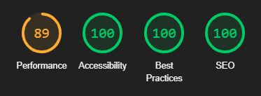

# Manuel Testing
## Bugs and Fixes During the Development Process
Below is a list of bugs and fixes found while creating a feature. You can find other bugs as bug tickets in [JIRA(https://dnlbowers.atlassian.net/jira/software/projects/PJG/issues/PJG-57?jql=project%20%3D%20%22PJG%22%20AND%20type%20%3D%20%22Bug%22%20ORDER%20BY%20created%20DESC)]. The Jira tickets are bugs found after I concluded the sprint including this feature because during the feature creation I missed the bugs.

* Issue - On the epic called "initial deployment,"  the final user story was to deploy to Heroku. When deploying, I got an application error when loading the app on Heroku.
* Cause - Checking the logs via the Heroku console, I could see it was having issues when looking for .env file. I purposely did not track this file to protect sensitive data such as the SECRET KEY and other privileged information, which one should never store publicly on GitHub. 
* Solution - As a result, I had to add a conditional statement to import the .env file containing the config vars required to run this application from my local machine. If the file exists, the basis of this conditional was to run the app using the contained config variables; if the file does not exist, it would skip the import process entirely and take the config vars entered on the Heroku app settings instead.

* Issue - When I pushed my code to GitHub, it detected I had installed  Django 3.2 from the requirements.txt; however, without the latest security patches.
* Cause - I used the Code institute recommended pip install Django==3.2 gunicorn command to install Django during the initial deployment. This installation did not include the latest security patches.
* Solution - I upgraded to the latest patch of this Django version with "pip install --upgrade django==3.2.12," and the error disappeared. Later the same issue occurred with version 3.2.12, and it was required to upgrade Django again to version 3.2.13

* Issue - early in the project, I found that most job APIs required O-auth, which did not match my current understanding of the taught fetch method. I found reed employment had an API that used basic authentication; however, it was getting blocked when using it from my localhost.
* Cause - Lack of understanding of using APIs requiring Oauth authentication.
* Solution - Since this was early in the project, I decided not to spend a lot of time on it. I was able to pull the data using the endpoint and API key in the browser address bar and saved that data to a JSON file. The JSON would serve as test data to build the site, and I would come back to the API issue at a later stage. (Later abandoned as part of the agile process in favor of a community job share site, I will look to implement an API again in the future)

* Issue - I was having trouble inserting my card component from within the job_search app into the required job-list page.
* Cause - At first, I thought it was a file path issue; however, after much research, I found [this article](https://www.geeksforgeeks.org/include-django-template-tags/) showing quotation marks surrounding the file path of the include property.
* Solution - Adding the quotation marks around the correct relative file path resolved the issue.

* Issue - Linking my custom base.html in the AllAuth template wasn't working no matter what file path I was using.
* Cause - My file structure using base.html only in the extends property wasn't enough; after a lot of dead-end research, I looked at the AllAuth views file to see where it was looking for the templates and saw it was checking the settings file.
* Solution - By adding os.path.join(BASE_DIR, 'templates', 'packages/allauth'). I was able to redirect the project to look here for AllAuth templates and enabling me to keep my packages separate from my custom code.

* Issue - Errors on Postgres database migrations.
* Cause - while coming to terms with how to use the model portion of Django, I recreated the models multiple times; this caused various errors when migrating changes to the database.
* Solution - I deleted the Postgres database from Heroku and my migration files and added a new Postgres server to Heroku. I then re-ran the migration commands to start the database over from scratch. Once migrated, I also needed to re-add the job data and recreate the superuser for testing purposes.

* Issue - Without touching my code between coding sessions, I had an error message saying it could not connect to my Heroku Postgres server database when running the server locally. 
* Cause - Due to an [Heroku maintenance](docs/images/heroku-maintenance.jpg) my DATABASE_URL had changed, causing my local .env file to be out of date. 
* Solution - Updating the DATABASE_URL resolved the issue with running the server locally. This

* Issue - Pinned jobs are not visible on the job list page but as pinned in the full job spec.
* Causes - I tried to use a form with a hidden submit button and use JS to hit the button on click of the pin job toggle. a Django form used in this manner caused issues in that I could not retrieve the data from the generic list view on the job list page. I could not see which Jobs as pinned unless on the full job post itself.
* Solution - I abandoned using a Django form for this, and I decided to use Javascript fetch method to handle the post request instead. However, the new method caused the issue to resolve, giving rise to the below bug.

* Issue - Pinned jobs displayed correctly on all pages, but I could not edit from the full job spec page.
* Cause - When attempting to toggle the job is_pinned status from the full job details page, it was adding /pinned/{job.id} to the end of the URL already containing the job id, causing a 404 error.
* Solution - adding "../" to the start of the fetch URL in the javascript file allowed the toggle to always start from the root URL when updating the pinned job status. 

* Issue - Bootstrap accordion wasn't closing a section when opening a new one.
* Cause - I failed to match the accordion ID with the data-bs-parent when tailoring the bootstrap code.
* Solution - Once I set these two attributes to the same ID, the accordion opened and closed as expected, one section at a time.

* Issue - Notes left were not user-specific, and all users could see all notes.
* Cause - I had not defined a variable in the view, which allowed me to use the logged-in user as part of the conditional in the template.
* Solution - By setting the author variable in the views.py, I matched the requesting user id in the Notes model to show the user their notes exclusively.

* Issue - If refreshing after submitting a note, a duplicate note got added to the database.
* Cause - Page was refreshing but not redirecting upon submission
* Solution - By adding ```return HttpResponseRedirect(reverse('note_made', args=[id]))``` after the form save which points to a new URL path upon submit, this fixed the issue of resubmitting the same form inputs twice.

* Issue - Pagination not working when displaying the job preview cards on the pinned posts page.
* cause - I initially created a functional view to display pinned posts that did not allow pagination.
* Solution - Using the generic class ListView with get_queryset to add the additional information required to render this feature using a generic class view.    

* Issue - Notes and pinned job posts remained until the page refreshed, even when deleted/unpinned.
* Cause - The pinned variable from the views required a page refresh to update the DOM. 
* Solution - By adding Jquery to show and hide the element, I made the toggle affect the DOM dynamically to display and hide the note section.

* Issue - When entering a pinned Jobs post full spec page, The notes section was hidden until unpinned and pinned again.
* Cause - I had made the notes section display none and removed the default to hide it when unpinned. 
* Solution - I added two bootstrap classes that hold the properties display inline if the job is_pinned, and if the job is_pinned equaled false, the property was displayed none. I chose to use custom classed over the bootstrap classes d-none and d-inline so that they did not interfere with the display of any property applied by the jquery hide property.

* Issue - When unpinning a job post from the saved jobs page, there was a gap left where the hidden element resided. Furthermore, removing multiple jobs at once caused issues with the pagination.
* Cause - Setting the generic class to paginate by 6, once the user removed enough posts and pressed the "next button, the "if paginated" condition was no longer True, causing a page not found error.
* Solution - By forcing the page to refresh with javascript after hiding the element, this caused the pinned posts to shuffle across when the page reloaded, meaning there would always be six pinned jobs per page, providing there were 6 to display.
 
* Issue - Notes and the pinned post remained until the page refreshed, even when deleted/unpinned.
* Cause - The displayed data is only retrieved by the logic in the view upon page refresh.
* Solution - Using Javascript to force a refresh after unpinning each job ensured that the elements filled all space on the page until only five or fewer entries remained to be displayed.

* Issue - using bootstrap alerts to display appropriate alerts to the user upon form submission was not displaying correctly.
* Cause - The original logic in the view was having trouble passing a success message when leaving a note or insight and redirecting pages(my solution to form duplication on page refresh). 
* Solution - After some research, I discovered a specific [message method](https://www.csestack.org/display-messages-form-submit-django/) for Django to use in unison with bootstrap alerts. Applying this resolved the issue.

* Issue - There was a console error on pages where the warning modal did not exist.
* Cause - Event listeners did not load for the modal regardless of whether the modal was present. This caused the browser to say it could not find various buttons when loading "warningModalEvents()."
* Solution - The console error disappeared by adding a truthy conditional statement to check if the modal was present before firing the event listener function. These event listeners would only load when the browser found the modals ID attribute.
 
* Issue - When on page two or more of a paginated page and removing items from it, a page not found error can occur if no more items remain on the page.
* Cause - The pagination feature is such that the last page can only exist if there are more items than the set "paginate_by" value. Removing surplus items causes the page not to exist.
* Solution - By using javascript, I checked when the relevant list node was equal to 1 and used this to trigger a function that takes the last digit from the URL and subtracts one before redirecting the user to the previous page.

* Issue - Page not found error when on page 1 and removing all the items.
* Cause - My previousPageRedirect function created in the above bugfix changed the page to page 0 when removing all the items from page 1.
* Solution - Added an extra conditional to this function so it wouldn't go below page 1 or reduce the page number if, by subtracting one, the result was NaN

* Issue - While testing the solution of bug fix ticket PJG-55, I found that when deleting insights from the insights page, they were not disappearing when the page refreshed.
* Cause - The delete note function was not applicable for the DOM on the insight page, so although I  removed the insight from the database, the item was still visible from the insights page.
* Solution - Creating a separate function similar to deleteNote for deleteInsight allowed me to traverse the DOM and remove elements from the timeline at the time of deletion.

* Issue - When registering with an email, a 500 error was displayed.
* Cause - I was missing several settings for all auth in my setting.py
* Solution -  I added the additional settings required in settings.py to handle an email on signing up for the issue.

# Wave Aim Accessability checker:
Contrast error found on disabled button. Due to the buttons not being accessible until logged in I deemed this unnecessary to fix.   
   
There was also an accessability issue found due to the label for the pin jobs toggle. setting this to display none, and adding some text in the tags resolved this.

# Lighthouse
During the lighthouse test I found some reduction to the Accessibility score on pages with a toggle switch. The error was "Form elements do not have associated labels". This was fixed by adding an aria-label to the pin jobs toggle. 

The lighthouse score also confirmed the poor contrast scores on the nav bar items that are disabled when signed out.

In general Mobile scores were lower in performance for two main reasons. cdn imports from bootstrap and jquery, and hero images which had already been compress multiple times.

## Job Openings 
### Logged out:
#### *Desktop*:


#### *Mobile*:


### Logged in:
#### *Desktop*:


#### *Mobile*:


## Full Job Spec 
### With Notes Displayed:
#### *Desktop*:

* Reduction in accessability score due to no title on the summernote iframe. 

#### *Mobile*:


### No Notes Displayed:
#### *Desktop*:


#### *Mobile*:


## Saved Jobs
#### *Desktop*:


#### *Mobile*:


## Tracking Instructions Page
#### *Desktop*:


#### *Mobile*:


## Contact Page
#### *Desktop*:


#### *Mobile*:


## Insights Page
#### *Desktop*:


#### *Mobile*:


## Add Insights Page
#### *Desktop*:

* Reduction in accessability score due to no title on the summernote iframe.

#### *Mobile*:


## Edit Notes Page
#### *Desktop*:

* Reduction in accessability score due to no title on the summernote iframe. 

#### *Mobile*:


## Add Job Page
#### *Desktop*:

* Reduction in accessability score due to no title on the summernote iframe. 

#### *Mobile*:


## Sign Out Page
#### *Desktop*:


#### *Mobile*:


## Sign in Page
#### *Desktop*:

* Reduction in accessability score due to Contrast on disabled navbar buttons

#### *Mobile*:


## Sign up Page
#### *Desktop*:

* Reduction in accessability score due to Contrast on disabled navbar buttons

#### *Mobile*:


# Validators
## [HTML](https://validator.w3.org):
When validating pages rendering text placed into a form field using the summernote editor there was an extra <p> tag which was injected by summernote. The tag was not visible to the users but was picked up by the validator.
 